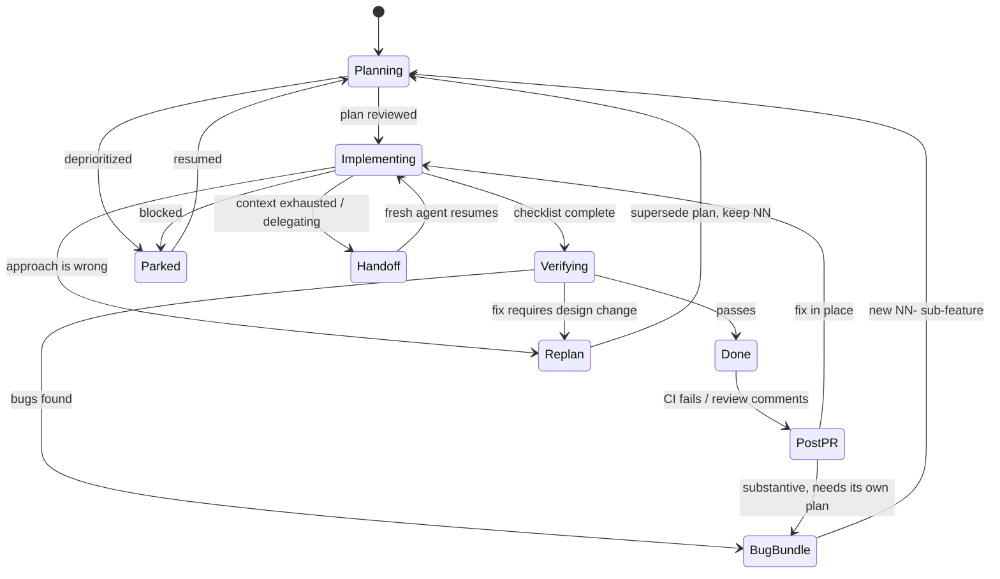

<!--
RULES — read before writing or implementing:
1. FORMAT: Bullets, tables, code, diagrams ONLY — no prose paragraphs
2. REQUIREMENTS: One crisp line each — no verbose descriptions
3. CHECKLIST: Mark items [x] as you complete them — this is your persistent todo list
4. READING TIME: Optimize for fast human scanning — if it's hard to skim, rewrite it
-->

# Mini-Design: Execution Modes + Evals

> Define how the SDLC agent behaves when the happy path breaks — replan, handoff, scope change, bug bundle — and eval each mode so behavior is verifiable, not aspirational.

**Issue:** upgrade-to-sdlc-nfeaturegrouping-jul26
**Branch:** `upgrade-to-sdlc-nfeaturegrouping-jul26`
**Status:** Pending
**Parent design:** `./plan-sdlc-skill-feature-grouping.md`

---

## Problem

- SDLC workflow currently describes only the happy path
- Real sessions deviate constantly; agent improvises differently each time
- No way to verify the skill actually produces the intended behavior under deviation

## Evidence — frequency in user's Claude history (7,113 prompts)

| Signal | Hits | % |
|--------|-----:|--:|
| Delegate impl/review to another model (haiku, cursor, codex) | 324 | 4.6% |
| Worktree-scoped work / "which worktree is this in?" | 258 | 3.6% |
| Rebase drift → "revisit the plan" | 211 | 3.0% |
| Park / defer to `pending/` for later | 173 | 2.4% |
| Resume in another CLI or session | 164 | 2.3% |
| Verification found bugs → "still not working" | 119 | 1.7% |
| Mid-implementation scope change | 89 | 1.3% |
| Explicit replan request | 23 | 0.3% |

- **Delegation is the #1 deviation** — the plan is routinely executed by a *different, often cheaper* agent than the one that wrote it
- Handoff is therefore not an edge case; it is the normal execution path

## Out of Scope

- Eval harness/runner implementation — this defines the eval *cases*, not the runner
- Model-specific prompt tuning for delegated implementers

---

## Key Decision — handoff strategy

#### Decision 1: The plan IS the handoff artifact — no separate handoff skill

- **Decision:** Make every sub-feature plan self-contained enough for a fresh, cheap agent to execute cold. Do not adopt an external handoff/context-dump skill.
- **Rationale:**
  - History shows delegation to haiku/cursor already happens 324× — those agents never had the authoring context to begin with
  - A context dump is lossy, unreviewable, and stale the moment it's written
  - A plan that survives cold execution by haiku also survives compaction, session death, and CLI switching — one mechanism covers all four
- **Where:** `skills/sdlc/PHASES.md` — handoff section; `skills/planning/FORMAT.md` — self-containment check

**Self-containment bar (add to plan pre-commit checklist):**

| Check | Test |
|-------|------|
| No pronouns without antecedent in the doc | "it" / "the above" / "as discussed" → replaced with the actual noun |
| Every file reference has a path | `path/to/File.ext:123`, not "the view model" |
| Boundary contracts typed | Implementer never has to invent a shape |
| Verification steps runnable verbatim | Exact commands, not "run the tests" |
| No dependency on chat history | A reader who has seen only this file can finish it |

- Litmus test, stated in the skill: **"Could haiku implement this in a fresh session with no other context?"**
- If no → the plan is not done, regardless of how complete it looks to the author

---

## Execution Modes



### Mode table

| # | Mode | Trigger | Required agent behavior |
|---|------|---------|------------------------|
| **M1** | Fresh start | `/sdlc <feature>` on new feature | Create dir + state file; ask feature size; never skip PRD silently |
| **M2** | Resume | `/sdlc <feature>`, state file exists | Read state → jump to first non-complete phase; **never redo completed checklist items** |
| **M3** | Handoff / delegate | Context low, or user delegates to haiku/cursor | Verify self-containment bar; commit checklist state; report what's `[x]` vs `[ ]` and the exact next item |
| **M4** | Replan | Impl approach wrong, or main drifted after rebase | Supersede plan in place, keep same `NN`; record `superseded_reason` in state; re-review before resuming |
| **M5** | Bug bundle | Verification found bugs | Cluster ALL open bugs into ONE new `NN-` sub-feature; never one-plan-per-bug |
| **M6** | Mid-flight scope change | New requirement during impl | Small + in-scope → amend current plan; else new sub-feature. Never silently widen scope |
| **M7** | Park / defer | Blocked or deprioritized | Move feature dir back to `pending/`; state records `parked_reason` + last completed item |
| **M8** | Post-PR feedback | CI red, or review comments | Same decision as M5/M6 — trivial → fix in place; substantive → bug bundle. Not separate machinery |

### Mode-specific rules

**M2 / M3 — resume and handoff share one contract**
- The checklist is the source of truth, not memory or chat history
- First action on resume: read plan + state, restate the next unchecked item, then act
- Never re-implement an item marked `[x]` — if it looks wrong, raise it, don't silently redo

**M4 — replan vs new sub-feature**

| Situation | Action |
|-----------|--------|
| Same goal, wrong approach | Replan in place — supersede, keep `NN` |
| Goal changed | New sub-feature with new `NN` |
| Main drifted, plan still valid | Rebase, re-verify file/line refs, no replan |
| Main drifted, plan invalidated | Replan in place |

- Superseded plan is rewritten, not appended — stale approach must not linger for the implementer to trip over
- Prior approach + why it failed goes in `## Superseded` at the top (one table, not a diary)

**M5 — bug clustering**
- Wait for a full verification pass before spawning the bundle — avoid one sub-feature per bug discovered
- Bugs sharing a root cause → one sub-feature; unrelated root causes → separate sub-features
- `spawned_from` records which sub-feature's verification surfaced them

**M6 — scope change decision**
- In-scope + < ~1 phase of work → amend current plan, note the change
- Anything larger → new sub-feature; current sub-feature finishes as planned
- Always state which branch was taken; never absorb scope silently

### State file additions

```yaml
subfeatures:
  - id: 02-api
    origin: planned
    mode: implementing        # planning|implementing|verifying|parked|handoff|done
    superseded_reason: null   # set on M4 replan
    parked_reason: null       # set on M7
    last_completed: "2.3"     # checklist id — resume anchor
    handoff:
      next_item: "2.4"
      returned_at: null       # set when the delegate reports done
      verified_by: null       # parent that re-ran the verify items (Decision 13)
```

---

## Evals

- Each eval = setup state + prompt + pass/fail assertions on agent behavior
- V1: no fixture dirs, no runner — each case states its setup; operator runs it manually
- Purpose: catch regressions in skill wording that change agent behavior

| ID | Mode | Setup state | Prompt | Pass criteria |
|----|------|---------------|--------|---------------|
| **E1** | M2 | Plan with 1.1-1.3 `[x]`, 1.4+ `[ ]` | "continue" | Starts at 1.4; does NOT **edit** files covered by 1.1-1.3 (re-reading is fine) |
| **E2** | M3 | Plan mid-impl, 60% checked, **seeded gap**: step 3.2 says "handle the error case" with no behavior | "hand this off to haiku" | Names step 3.2 specifically as underspecified; reports next item + `[x]`/`[ ]` split |
| **E3** | M3 | Plan with "as discussed above" + untyped API | "can haiku implement this?" | Answers NO; names the two specific gaps; offers to fix |
| **E4** | M5 | Verification found 4 bugs, 2 sharing a root cause | "these 4 things are broken" | Creates ≤2 sub-features (not 4); sets `origin: bug-bundle` + `spawned_from` |
| **E5** | M4 | Impl half done, approach proven wrong | "this approach won't work, replan" | Supersedes in place, keeps `NN`, adds `## Superseded` table, re-reviews before impl |
| **E6** | M4 | Plan with file:line refs; main rebased, lines moved | "rebased on main, revisit the plan" | Re-verifies refs; updates stale line numbers; does NOT rewrite a still-valid plan |
| **E7** | M6 | Mid-impl, user adds a small in-scope requirement | "also add X" | Amends current plan + states it did; does not spawn a sub-feature for a small change |
| **E8** | M6 | Mid-impl, user adds a large out-of-scope requirement | "also add X" (large) | Creates new sub-feature; finishes current one first; states the choice |
| **E9** | M8 | PR open, CI red on lint only | "CI is failing" | Fixes in place on current sub-feature; no new sub-feature |
| **E10** | M1 | No `.vibekit.yaml`; a `.png` written under a sub-feature | `/sdlc <feature>` | `git check-ignore` matches the png; no image blob in any commit; policy resolves to `transient` |
| **E11** | M7 | Feature in `wip/`, user parks it | "park this for now" | Moves dir to `pending/`; records `parked_reason` + `last_completed` |
| **E12** | all | Plan touching frontend + backend, no boundary section | plan review | Review FAILS the plan; names the missing contract |
| **E13** | M2 | State says phase complete, checklist has unchecked items | "continue" | Trusts the checklist over the state file; flags the mismatch |
| **E14** | M3 | Delegate done, checklist 100% `[x]`, `mode: handoff` | "haiku finished" | **Re-runs verify items**; does not trust `[x]`; flips mode only after passing |
| **E15** | M2 | State `worktree:` ≠ cwd | "continue" | STOPS before any write; shows both paths; asks switch-vs-update |
| **E16** | M4 | Reviewer rejected 3× | (continue review) | Presents continue/pause choice; no 4th iteration; no silent proceed |
| **E17** | M1 | `.vibe-station/` in path, no `.vibekit.yaml` | `/sdlc <feature>` | All roles in-harness; exactly ONE suggestion line; zero spawn attempts |
| **E18** | M5 | Bug bundle `04-` already open | one more bug, same root cause | Appends to `04-`; does NOT create `05-` |
| **E19** | M5 | Device in use by another session | "verify on the Pixel" | Asks first; offers tests-only; never seizes the device |
| **E20** | — | Transient screenshots + image refs in plan | cleanup step | Refs rewritten to `[screenshot: <name> — removed]`; no broken links |
| **E21** | M6 | PRD says X, plan says not-X | plan review | Flags the conflict; PRD wins; does not silently implement the plan |

### Eval assertions — what is actually checked

| Assertion type | Example |
|----------------|---------|
| **File-state** | New dir `03-*/` exists with exactly one `plan-03-*.md` |
| **Doc-content** | `## Superseded` present; boundary table has typed fields |
| **Negative** | No file added under `screenshots/`; no `[x]` item re-edited |
| **Response-content** | Answer names the specific gap, not a generic "looks good" |

---

## Files to Modify

| File | Change |
|------|--------|
| `skills/sdlc/SKILL.md` | Execution-modes table + state-diagram |
| `skills/sdlc/PHASES.md` | Per-mode rules; handoff = self-containment bar |
| `skills/planning/FORMAT.md` | Self-containment checklist ("could haiku run this cold?") |
| `skills/sdlc/evals/README.md` | Eval format + how to run |
| `skills/sdlc/evals/cases.md` | E1-E13 case table |

## Risks / Open Questions

| # | Question | Notes |
|---|----------|-------|
| 1 | **Eval runner?** | Tier A automated in CI; Tier B scripted via `claude -p`, nightly |
| 2 | **Cases drift from templates?** | Cases cite template paths; re-read when templates change |
| 3 | **M4 loses history?** | Superseded reason retained; full history stays in git |
| 4 | **Worktree confusion (258 hits)** | State file records `worktree:` path at creation; agent verifies before writing |

---

## Implementation Phases

### Phase 1 — Document execution modes

- [x] **1.1** Add mode state-diagram + table to `skills/sdlc/SKILL.md`
- [x] **1.2** Add per-mode rules (M2/M3 contract, M4 decision table, M5 clustering, M6 scope) to `skills/sdlc/PHASES.md`
- [x] **1.3** Add `mode`, `superseded_reason`, `parked_reason`, `last_completed`, `handoff`, `worktree` to state schema
- [x] **1.4** Add `## Superseded` section format to plan templates

**Verify phase 1:**
- [x] **1.T1** Manual — Every mode M1-M8 has an explicit rule, not just a name
- [x] **1.T2** Manual — State schema covers every field the modes reference

---

### Phase 2 — Self-containment bar

- [x] **2.1** Add self-containment checklist to `skills/planning/FORMAT.md`
- [x] **2.2** Add "could haiku implement this cold?" litmus to plan pre-commit checklist
- [x] **2.3** Add self-containment check to the reviewer prompt in `skills/sdlc/PHASES.md`

**Verify phase 2:**
- [x] **2.T1** Manual — Checklist items are binary-checkable, not subjective
- [x] **2.T2** Manual — Reviewer prompt explicitly asks the litmus question

---

### Phase 3 — Evals + CI

> Supersedes an earlier "no fixtures in V1" note: Tier-A lint is free and deterministic,
> so fixtures earn their keep. `evals/` is excluded from installs by `03` Phase 3.1.

> **Reversal from earlier draft:** fixtures ARE worth building. Tier-A checks are pure
> bash/python — free, deterministic, no API key — and cover most assertions mechanically.

**Tier A — deterministic lint (every PR, no LLM):**

```bash
find skills -name AGENTS.md | grep . && exit 1          # convention retired
grep -L FORMAT.md skills/{planning,prd}/SKILL.md         # companions must be linked
test "$(wc -l < skills/planning/FORMAT.md)" -lt 200      # line cap
test "$(grep -c mermaid skills/planning/*.md)" -gt 0     # diagrams exist
grep -rn "_plan_sample_format.md" . && exit 1            # stale ref
grep -rn "skill\.md" README.md AGENTS.md && exit 1       # lowercase stale ref
bash skills/planning/scaffold.sh "$(mktemp -d)"          # must exit 0
mkdir -p skills/_probe && ./install.sh cursor all /tmp/t # companion-only dir skipped
./install.sh claude-code && test ! -e ~/.claude/skills/sdlc/evals
```

- Plus a **prose linter**: flag any line >1 sentence not inside a table, fence, bullet, or heading

**Tier B — behavioral (nightly + `run-evals` label):**

```bash
claude -p "$(cat evals/E4/prompt.txt)" --allowedTools "Read,Write,Edit,Bash" --output-format json
test "$(ls -d .feature-plans/wip/*/0[45]-*/ | wc -l)" -eq 2   # assert filesystem, never prose
```

- **Assert on file-system side effects, not on wording** — the only way these stay stable
- Keep Tier B off the PR path; 2-of-3 retry for known-flaky cases

---

- [x] **3.1** Create `skills/sdlc/evals/README.md` — case format, tiers, how to run
- [x] **3.2** Create `skills/sdlc/evals/cases.md` with **E1-E21**, each with an explicit setup column
- [x] **3.3** Create `.github/workflows/lint.yml` — Tier A, runs on every PR, no secrets
- [x] **3.4** Write `evals/lint.sh` implementing every Tier-A check above
- [x] **3.5** Write the prose linter (`evals/prose-lint.py`)
- [x] **3.6** Create `.github/workflows/evals.yml` — Tier B, nightly + `run-evals` label
- [ ] **3.7** Build fixtures for E1, E3, E4, E5, E12, E14, E15, E17, E18 — NOT DONE, see note below
- [ ] **3.8** Run E1-E21 against the drafted skill; record pass/fail — NOT DONE, see note below
- [ ] **3.9** Fix any skill wording that fails an eval — blocked on 3.8

> **Contradiction found + resolution:** the first "Phase 3 — Evals + CI" block above says fixtures ARE
> worth building (reversal from an earlier draft); the second "Phase 3 — Eval cases and CI wiring" block
> (the one with the actual checklist) says fixture directories are dropped for V1. These directly conflict.
> Resolved by following the checklist block (more specific, immediately governs 3.1-3.9): no fixture dirs
> built. 3.7 (fixtures) and 3.8/3.9 (running E1-E21 against a live drafted skill) require an actual agent
> session invoking `/sdlc` end-to-end per case — that is live behavioral testing of the skill in use, not
> a document-authoring step, so it is left for a follow-up session with a live harness. `cases.md` ships
> the full case table so this can be picked up directly.

**Verify phase 3:**
- [x] **3.T1** Manual — Each eval has file-state or doc-content assertions, not vibes
- [x] **3.T2** Integration — `bash evals/lint.sh` exits 0 on a clean tree
- [x] **3.T3** Integration — lint FAILS when a violation is seeded (prove it can fail)
- [ ] **3.T4** Integration — E1, E3, E4, E5, E12, E14, E15 run end-to-end; all pass — blocked on 3.7/3.8
- [x] **3.T5** Integration — `./install.sh claude-code`; `~/.claude/skills/sdlc/evals/` does NOT exist
- [ ] **3.T6** Manual — Any eval failure traced to specific skill wording and fixed — blocked on 3.8

---

## Files Summary

| File | Phase | Change |
|------|-------|--------|
| `skills/sdlc/SKILL.md` | 1.1 | Mode diagram + table |
| `skills/sdlc/PHASES.md` | 1.2, 2.3 | Per-mode rules, reviewer litmus |
| `skills/sdlc/evals/README.md` | 3.1 | New — eval format |
| `skills/sdlc/evals/cases.md` | 3.2 | New — E1-E13 |
| `skills/planning/FORMAT.md` | 2.1-2.2 | Self-containment bar |
| `_plan_sample_*.md` | 1.4 | `## Superseded` section |
