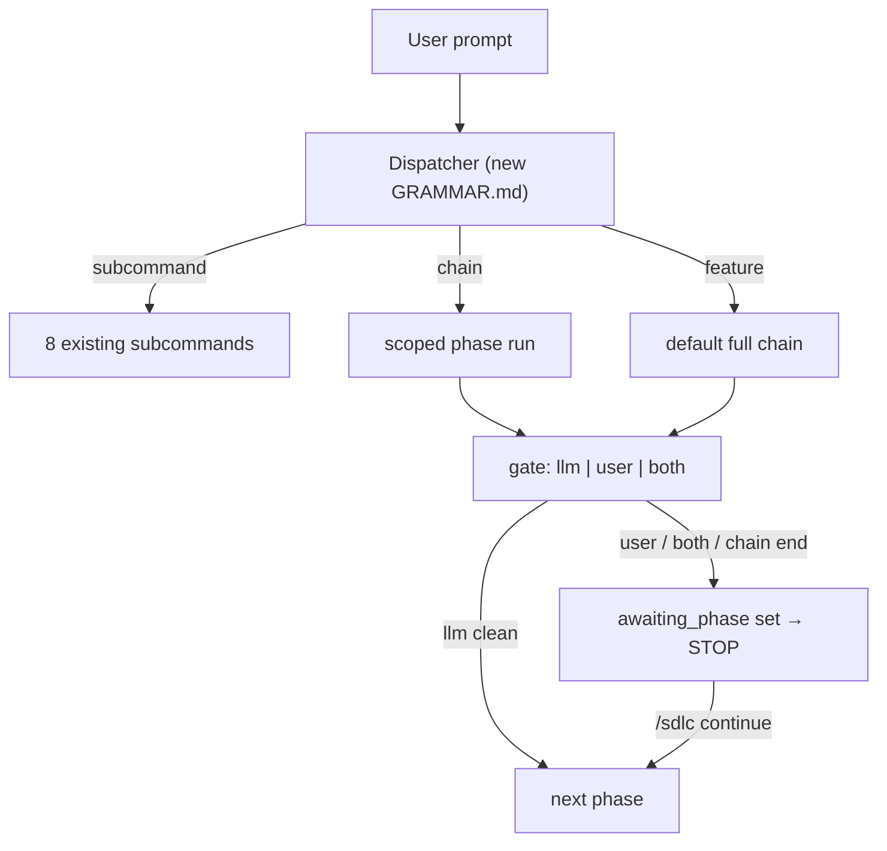
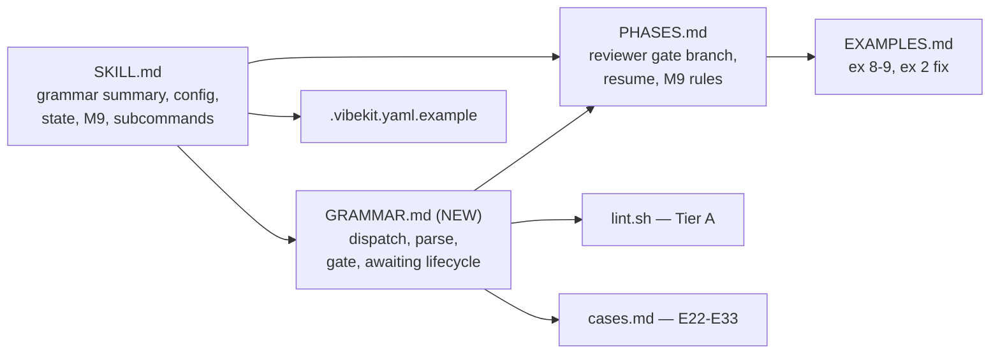
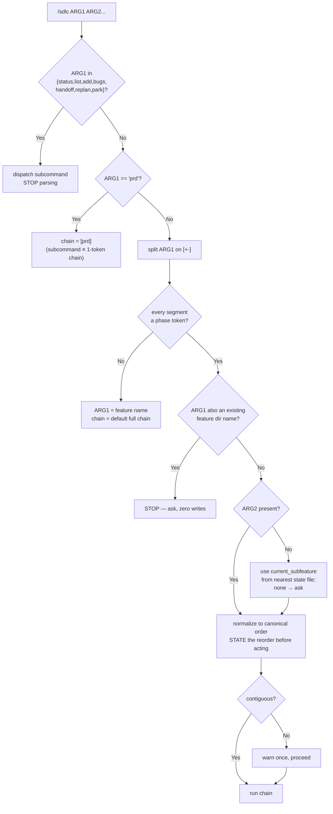

<!--
RULES — read before writing or implementing:
1. FORMAT: Bullets, tables, code, diagrams ONLY — no prose paragraphs
2. REQUIREMENTS: One crisp line each — no verbose descriptions
3. CHECKLIST: Mark items [x] as you complete them — this is your persistent todo list
4. READING TIME: Optimize for fast human scanning — if it's hard to skim, rewrite it
-->

# Mini-Design: SDLC Phase Composition + Human Review Gate

> Let the user compose which SDLC phases run in one invocation (`/sdlc prd+plan <feature>`, `/sdlc prd-plan-implement <feature>`), make the end of that chain a hard stop for human review, and make the pause survive a context reset.

**Issue:** upgrade-to-sdlc-nfeaturegrouping-jul26
**Branch:** `upgrade-to-sdlc-nfeaturegrouping-jul26`
**Status:** Implemented — all 6 phases complete, both linters green, not yet committed
**Parent design:** `./plan-sdlc-skill-feature-grouping.md`
**Depends on:** `03-sdlc-orchestration.md` (skill exists), `05-execution-modes.md` (M1-M8 + eval harness)
**Reviewed by:** opus subagent, 2026-07-29 — B1-B7 blockers resolved in this revision

---

## Problem

- `/sdlc <feature>` runs the whole chain PRD → plan → review → implement → verify → review; there is no way to ask for *part* of it
- `/sdlc prd <feature>` is the only phase-scoped subcommand (`skills/sdlc/SKILL.md:197`) — no `plan` equivalent, no way to combine two phases
- "Write the plan and wait for me" is expressible only as prose (`skills/sdlc/EXAMPLES.md:121`) — an instruction, not a rule, so it is lost on context reset or handoff
- Every review in the chain is an **LLM** reviewer (`skills/sdlc/PHASES.md:18-37`); human approval is not a modelled phase outcome
- `.sdlc-state.yaml` has no field meaning "artifact written, waiting on the human" — a resumed session cannot tell "paused for review" from "in progress"

## Out of Scope

- **Planner model selection** (`roles.planner.model`) — the planner is in-harness by design (`skills/sdlc/SKILL.md:256`), so a model field is unimplementable without redesigning the planner role; deferred (Decision 12)
- Per-phase reviewer models — `reviewer.model` stays global (Decision 13)
- Parallel phase execution — V1 chains are sequential (`skills/sdlc/SKILL.md:281`)
- Cursor/Gemini slash-command surfaces — `/sdlc` remains Claude Code only in V1 (`skills/sdlc/EXAMPLES.md:76`)
- Renaming or removing any existing subcommand
- Retrofitting line caps onto pre-existing over-cap files (`EXAMPLES.md` 370, `SKILL.md` 281) — flagged, not fixed here

## Concept

- One new grammar: **`/sdlc [<chain>] <feature>`**, where `<chain>` is phase tokens joined by `+` or `-`
- Dispatch precedence is fixed and total: **subcommand → chain → feature name**
- The chain is **exhaustive and terminal** — the agent runs exactly those phases, then stops; it never advances past the last token
- No chain → today's full default chain (pure backward compat)
- New `sdlc.reviewer.gate` config decides whether an LLM review, a human review, or both close each artifact phase
- New **orthogonal** state fields `awaiting_phase` / `awaiting_artifact` persist the pause — `mode` is untouched, so the prior mode is never destroyed
- New execution mode **M9 — scoped invocation** joins M1-M8

---

## Requirements

| # | Requirement |
|---|-------------|
| 1 | Phase tokens: `prd`, `plan`, `implement` (alias `impl`), `verify`, `review` |
| 2 | Separators `+` and `-` are interchangeable — `prd+plan` ≡ `prd-plan` |
| 3 | Dispatch precedence: arg 1 matching a registered subcommand wins outright, before any chain parsing |
| 4 | `prd` resolves as the existing subcommand, which is *defined* as the 1-token chain `[prd]` — one behavior, two spellings |
| 5 | Arg 1 is a chain **iff** it is not a subcommand **and** every `+`/`-` separated segment is a phase token |
| 6 | `/sdlc <feature>` (no chain) behaves exactly as today — full chain, no behavior change |
| 7 | Chain end is a **hard stop**: agent never runs a phase not in the chain, even after a clean review |
| 8 | On chain end: write `awaiting_phase` + `awaiting_artifact` to state, report, stop |
| 9 | `mode` is **not** overwritten by the pause — `awaiting_phase != null` is the "do not advance" signal |
| 10 | Tokens run in canonical order regardless of typed order; reorder is stated **before** acting, never silent |
| 11 | Non-contiguous chain (e.g. `prd+implement`) allowed but warned once per invocation |
| 12 | Ambiguity (feature dir named like a phase token or subcommand) → stop and ask, zero writes first |
| 13 | New `sdlc.reviewer.gate: llm \| user \| both`, default `llm` (= today's behavior) |
| 14 | `gate: user` → no reviewer subagent spawned; artifact phase ends awaiting the human |
| 15 | `gate: both` → reviewer runs to completion, *then* still stops for the human |
| 16 | `gate: user` suppresses the reviewer-unavailable fallback and the `max_iterations` cap — no reviewer was requested |
| 17 | Resume with `awaiting_phase` set → restate the awaited artifact and ask; never auto-advance |
| 18 | A follow-up prompt naming the **same** artifact iterates within that phase — it does not advance (preserves `EXAMPLES.md:89-118`) |
| 19 | New `/sdlc continue` — advances **exactly one** phase past `awaiting_phase`, then re-evaluates |
| 20 | `/sdlc continue` with no `awaiting_phase` set → say so and resume normal M2 behavior |
| 21 | `review` token = one reviewer pass on the newest completed artifact; it **replaces** that phase's gate pass, never doubles it |
| 22 | `review` on a feature with no artifact → stop and ask, do not create one |
| 23 | `phase_chain` recorded **per sub-feature**, not feature-wide |
| 24 | `awaiting_phase` blocks the queue drain to `done/` by design; `/sdlc status` and `/sdlc list` surface it |
| 25 | Parse + gate rules live in a new `GRAMMAR.md` companion — `PHASES.md` is at 190/200 lines |
| 26 | Evals: Tier A lint checks (non-vacuous — each must fail on today's tree) + Tier B cases E22-E33 |
| 27 | Docs: `SKILL.md`, `PHASES.md`, `GRAMMAR.md`, `EXAMPLES.md`, `evals/*`, `.vibekit.yaml.example` consistent |

---

## Research

| Finding | Location | Risk if ignored |
|---------|----------|-----------------|
| 8 subcommands already own arg-1 namespace | `skills/sdlc/SKILL.md:190-201` | **High** — an unguarded chain parser turns `/sdlc status` into a feature named `status` |
| `/sdlc prd` iteration loop keeps `master.prd: pending` across rounds | `skills/sdlc/EXAMPLES.md:110-118` | **High** — a naive chain-end stop breaks documented multi-round PRD iteration |
| `mode` is single-valued | `skills/sdlc/SKILL.md:223` | **High** — an `awaiting_user` enum value destroys the prior mode; nothing to restore on continue |
| `cancelled` exists *only* to unblock the queue drain | `skills/sdlc/PHASES.md:181-183` | **Med** — a new blocking state needs the same explicit treatment |
| "Reviewer unavailable → continue without review" | `skills/sdlc/SKILL.md:85`, `PHASES.md:24` | **Med** — contradicts `gate: user` unless scoped |
| "**Every** review step … caps at `max_iterations`" | `skills/sdlc/SKILL.md:141` | **Med** — false under `gate: user` |
| `PHASES.md` is 190 lines; cap is 200 | `skills/coding-agent-guardrails/SKILL.md:24` | **Med** — Phase 2 breaches it without a split |
| CI installs no PyYAML | `.github/workflows/lint.yml:12-14` | **Med** — a bare `import yaml` in lint.sh fails CI for an unrelated reason |
| `lint.sh` line-cap check covers only `skills/planning/*` | `skills/sdlc/evals/lint.sh:32-40` | Low — `skills/sdlc/*` caps unenforced |
| All 5 phase-token words already appear in both SKILL.md and PHASES.md | verified by grep on HEAD | **High** — a bare word-presence lint is vacuous |
| `/sdlc backup-restore` appears twice in EXAMPLES.md | `skills/sdlc/EXAMPLES.md:34,258` | **High** — a naive "contains a `-` chain" lint is vacuous |

---

## System Context



---

## Entities & Modules

| File | Role | Public surface |
|------|------|----------------|
| `skills/sdlc/SKILL.md` | Entry point | Grammar summary, config schema, state schema, M9, subcommand table |
| `skills/sdlc/GRAMMAR.md` | **NEW** companion | Dispatch precedence, parse algorithm, gate semantics, `awaiting_*` lifecycle |
| `skills/sdlc/PHASES.md` | Per-phase behavior | Reviewer invocation branches on gate; resume honors `awaiting_phase` |
| `skills/sdlc/EXAMPLES.md` | Worked usages | Examples 8-9; example 2 trace corrected |
| `skills/sdlc/evals/lint.sh` | Tier A | 5 new non-vacuous checks |
| `skills/sdlc/evals/cases.md` | Tier B | E22-E33 |
| `.vibekit.yaml.example` | Config template | `reviewer.gate` |

---

## Architecture



- Pure documentation change — no runtime code; the "implementation" is skill wording that changes agent behavior
- Enforcement is Tier A lint (mechanical doc-content assertions) + Tier B behavioral cases

---

## Design Details

### CUJ 1 — plan only, then wait

| # | User | Agent |
|---|------|-------|
| 1 | `/sdlc plan auth-flow` | `plan` is not a subcommand → all segments are tokens → chain `[plan]` |
| 2 | | Writes `plan-auth-flow.md`; gate `llm` → one reviewer pass |
| 3 | | Chain exhausted → `awaiting_phase: plan`, `awaiting_artifact: <path>`; reports; **stops** |
| 4 | "tighten the boundary contract" | Same artifact named → iterate in place (Req 18); still awaiting |
| 5 | `/sdlc continue` | Clears `awaiting_*`, runs `implement` only, then awaits again |

### CUJ 2 — collision

| # | User | Agent |
|---|------|-------|
| 1 | `/sdlc plan` where a feature dir `plan/` exists | Detects ambiguity → **zero writes** → asks chain-vs-feature |

### Phase tokens

| Token | Alias | Artifact written | `awaiting_phase` on chain end |
|-------|-------|------------------|-------------------------------|
| `prd` | — | `prd-<feature>.md` | `prd` |
| `plan` | — | `plan-<feature>.md` or `plan-<NN>-<feature>-<sub>.md` | `plan` |
| `implement` | `impl` | source diff + `[x]` marks | `implement` |
| `verify` | — | test/device results in the plan's verify block | `verify` |
| `review` | — | reviewer report on the newest completed artifact | `review` |

- Canonical order: `prd` < `plan` < `implement` < `verify` < `review`
- `review` **replaces** the gate's own reviewer pass for that artifact (Req 21) — never two passes

### Dispatch precedence



- Precedence is **total** — every arg-1 string resolves to exactly one branch (Req 3, 5)
- `/sdlc add plan` → `add` is a subcommand → dispatch; `plan` is its `<name>` arg, never a chain
- Rule 5 makes `/sdlc backup-restore` unambiguous: `backup` is not a phase token → whole arg is the feature
- A near-token (`planning`, `implementation`) is not a token → treated as a feature name; no fuzzy matching

### Gate semantics

| `gate` | Reviewer subagent | Stops for human | `max_iterations` applies | Reviewer-unavailable fallback |
|--------|:-----------------:|:---------------:|:------------------------:|:-----------------------------:|
| `llm` (default) | ✅ | ❌ auto-advance when clean | ✅ | ✅ warn + continue |
| `user` | ❌ | ✅ | ❌ n/a | ❌ n/a — none requested |
| `both` | ✅ | ✅ | ✅ | ✅ warn + still stop for human |

- Gate governs **artifact phases inside a chain**; the **chain end always stops**, whatever the gate
- `gate: user` does **not** mean "review is broken" — Req 16 scopes `SKILL.md:85` and `SKILL.md:141` to `llm`/`both`

### Data Model — new + changed fields

| Entity | Field | Type | Default | Constraints |
|--------|-------|------|---------|-------------|
| `.vibekit.yaml` | `sdlc.reviewer.gate` | enum | `llm` | `llm` \| `user` \| `both`; unknown → warn + treat as `llm` |
| `.sdlc-state.yaml` → `subfeatures[]` | `phase_chain` | list of phase tokens | `null` | canonical order; `null` = default full chain |
| `.sdlc-state.yaml` → `subfeatures[]` | `awaiting_phase` | enum \| null | `null` | one of the 5 phase tokens; **non-null ⇒ do not advance** |
| `.sdlc-state.yaml` → `subfeatures[]` | `awaiting_artifact` | repo-relative path \| null | `null` | non-null iff `awaiting_phase` non-null; `implement` → the plan file |
| `.sdlc-state.yaml` → `subfeatures[]` | `mode` | enum | — | **unchanged** — `awaiting_user` is NOT added |

```yaml
subfeatures:
  - id: 02-api
    mode: planning                              # preserved, never overwritten by the pause
    phase_chain: [prd, plan]                    # NEW — scope of this invocation
    awaiting_phase: plan                        # NEW — null when not paused
    awaiting_artifact: ".feature-plans/wip/auth-flow/02-api/plan-02-auth-flow-api.md"   # NEW
```

- Checklist still wins over state on conflict (`skills/sdlc/SKILL.md:206`) — unchanged
- Two pause representations are reconciled: `master.prd: pending` = artifact incomplete; `awaiting_phase` = agent blocked on the human

### M9 — scoped invocation

| Trigger | Required agent behavior |
|---------|------------------------|
| `/sdlc <chain> <feature>` | Run exactly the chain; stop at its end; set `awaiting_*`; report artifact path + what would come next; do NOT start it |
| Resume with `awaiting_phase` set | Restate the awaited artifact and ask; never auto-advance |
| Follow-up naming the same artifact | Iterate within that phase; `awaiting_*` stays set |
| `/sdlc continue` | Advance **one** phase; set `awaiting_*` again at the new stop |
| `/sdlc continue`, nothing awaiting | Say so; fall through to normal M2 resume |

### Key Decisions

#### Decision 1: Chain is arg 1, feature is arg 2
- **Decision:** `/sdlc prd+plan auth`, not `/sdlc auth --phases=prd,plan`
- **Rationale:** matches how the user already types it; a flag form is verbose and was not the ask
- **Where:** `skills/sdlc/SKILL.md` § Invocation grammar (new)

#### Decision 2: Subcommands win over chains, absolutely
- **Decision:** arg 1 matching one of the 8 registered subcommands dispatches immediately, before any `+`/`-` split
- **Rationale:** without this, `/sdlc status` parses as a feature named `status` and starts a full SDLC run
- **Where:** `skills/sdlc/GRAMMAR.md` § Dispatch precedence; `skills/sdlc/SKILL.md:190-201`

#### Decision 3: `prd` is one behavior with two spellings
- **Decision:** the existing `/sdlc prd <feature>` subcommand is *defined* as the 1-token chain `[prd]`
- **Rationale:** `prd` is in both namespaces; defining them as identical removes the conflict instead of ranking it
- **Where:** `skills/sdlc/SKILL.md:197`; `skills/sdlc/GRAMMAR.md` § Dispatch precedence

#### Decision 4: "All segments are tokens" decides chain-vs-feature
- **Decision:** deterministic set-membership test, no heuristics, no fuzzy matching
- **Rationale:** positional-only parsing breaks `/sdlc backup-restore`; fuzzy matching is unpredictable
- **Where:** `skills/sdlc/GRAMMAR.md` § Parse algorithm

#### Decision 5: Collision → ask, zero writes
- **Decision:** a feature dir named like a token stops the agent before any file write
- **Rationale:** a wrong guess silently runs the wrong phases on the wrong target
- **Where:** `skills/sdlc/GRAMMAR.md` § Ambiguity; eval E25

#### Decision 6: Chain end is a hard stop
- **Decision:** the agent never runs a phase outside the chain, even after a clean review
- **Rationale:** this is the entire point — a rule survives context reset, prose (`EXAMPLES.md:121`) does not
- **Where:** `skills/sdlc/SKILL.md` § Invocation grammar; `skills/sdlc/PHASES.md` § M9

#### Decision 7: `gate` is standing policy, chain is per-invocation scope
- **Decision:** two orthogonal knobs, not one
- **Rationale:** conflating them means retyping the chain forever to keep a standing preference
- **Where:** `skills/sdlc/SKILL.md` § Config schema; `skills/sdlc/GRAMMAR.md` § Gate semantics

#### Decision 8: Default `gate: llm`
- **Decision:** default preserves today's behavior exactly
- **Rationale:** defaulting to `both` silently makes every existing workflow interactive
- **Where:** `.vibekit.yaml.example`; `skills/sdlc/SKILL.md:62`

#### Decision 9: Pause is an orthogonal field, not a `mode` value
- **Decision:** `awaiting_phase` / `awaiting_artifact` alongside `mode`; `mode` enum unchanged
- **Rationale:** a `mode: awaiting_user` value destroys the prior mode with nothing to restore on `continue`, and cannot coexist with `handoff` or `parked`
- **Where:** `skills/sdlc/SKILL.md:208-235` § state schema

#### Decision 10: `/sdlc continue` advances exactly one phase
- **Decision:** not "resume the default chain"
- **Rationale:** promoting a 2-phase scope to the full 6-phase chain contradicts Decision 6
- **Where:** `skills/sdlc/SKILL.md` § Subcommands; eval E28

#### Decision 11: Reorder is announced before acting, not after
- **Decision:** `/sdlc implement+plan` normalizes, but says so first
- **Rationale:** `implement+plan` after a failed impl plausibly means M4 replan — announcing lets the user correct before work happens
- **Where:** `skills/sdlc/GRAMMAR.md` § Normalization; eval E31

#### Decision 12: `roles.planner.model` cut to a follow-up
- **Decision:** not in this change
- **Rationale:** the planner is in-harness *because* detaching breaks the iteration loop (`SKILL.md:256`); a model field either contradicts that or is a no-op. Orthogonal to chains and gates
- **Where:** Out of Scope; future sub-feature

#### Decision 13: Per-phase reviewer models deferred
- **Decision:** `reviewer.model` stays global
- **Rationale:** orthogonal; would double this change's surface
- **Where:** Out of Scope

#### Decision 14: New `GRAMMAR.md` companion instead of growing `PHASES.md`
- **Decision:** parse + gate rules go in a new file, linked from `SKILL.md`
- **Rationale:** `PHASES.md` is 190/200 lines; Phase 2 adds ~40. Matches the CLAUDE.md companion convention (named for content, linked from SKILL.md)
- **Where:** `skills/sdlc/GRAMMAR.md`; `skills/coding-agent-guardrails/SKILL.md:24`

---

## Files to Modify

| File | Change |
|------|--------|
| `skills/sdlc/GRAMMAR.md` | **NEW** — dispatch precedence, parse algorithm, gate semantics, `awaiting_*` lifecycle |
| `skills/sdlc/SKILL.md` | Grammar summary + link, `reviewer.gate`, state fields, M9 row, `/sdlc continue`, scope `:85` and `:141` to gate, counts at `:20`/`:184` |
| `skills/sdlc/PHASES.md` | Reviewer invocation branches on gate; resume honors `awaiting_phase`; M9 rules; header `M1–M9` |
| `skills/sdlc/EXAMPLES.md` | Examples 8-9; quick index rows; example 2 trace fix; header count |
| `skills/sdlc/evals/cases.md` | E22-E33; H1 + status row |
| `skills/sdlc/evals/README.md` | `E1-E21` → `E1-E33` |
| `skills/sdlc/evals/lint.sh` | 5 new non-vacuous Tier A checks |
| `.vibekit.yaml.example` | `sdlc.reviewer.gate` |
| `CLAUDE.md` | `GRAMMAR.md` in the repo-layout companion list |

---

## Risks / Open Questions

| # | Risk | Mitigation |
|---|------|-----------|
| 1 | Chain/feature/subcommand ambiguity misfires | Precedence is total (Decision 2-4); E25/E26/E32 pin all three branches |
| 2 | `gate` default changes existing behavior | Default `llm` = status quo; E29/E30 fire only with explicit config |
| 3 | `awaiting_phase` never cleared → sub-feature stuck, queue never drains | `/sdlc continue` (Req 19) + E28; surfaced by `/sdlc status`/`list` (Req 24, items 1.10/3.5); documented as intentional-blocking like `cancelled` |
| 4 | Docs drift between SKILL.md / GRAMMAR.md | Tier A check 5.T3 diffs the two token tables structurally |
| 5 | Lint checks pass vacuously | Every new check must be shown to **fail on HEAD** before the doc edit lands (item 5.T1) |
| 6 | PyYAML absent in CI | Item 4.2 makes the YAML check skip-with-notice when `import yaml` fails |
| 7 | `EXAMPLES.md` (370) / `SKILL.md` (281) already exceed the 200-line agent-guide cap | Out of scope here; recorded as an open question below |

**Open questions**

| # | Question | Notes |
|---|----------|-------|
| Q1 | Should `EXAMPLES.md`/`SKILL.md` be split to meet the 200-line cap? | Pre-existing breach; adding examples worsens it. Raise separately |
| Q2 | Is Tier B ever run in CI? | `05-execution-modes.md:293` item 3.6 is `[x]` but only `.github/workflows/lint.yml` exists — no `evals.yml`. Testing Strategy below claims manual-only |

---

## Implementation Phases

### Phase 1 — `GRAMMAR.md` (new companion)

- [x] 1.1 Create `skills/sdlc/GRAMMAR.md` with the header-comment block matching `PHASES.md:1-4` style and a "read SKILL.md first" note
- [x] 1.2 `## Dispatch precedence` — the 8 subcommands listed verbatim from `SKILL.md:190-201`, `prd`-as-1-token-chain rule (Decision 3), and the mermaid from Design Details
- [x] 1.3 `## Parse algorithm` — phase-token table (5 rows + `impl` alias), separator rule, "all segments are tokens" test, near-token non-matching
- [x] 1.4 `## Ambiguity` — collision → stop, zero writes; missing-ARG2 → `current_subfeature`, else ask
- [x] 1.5 `## Normalization` — canonical order, announce-before-acting (Decision 11), non-contiguous warn-once-per-invocation
- [x] 1.6 `## Gate semantics` — the 5-column gate table verbatim from Design Details, incl. `max_iterations` and reviewer-unavailable columns
- [x] 1.7 `## awaiting lifecycle` — set on chain end / gate stop, preserved across follow-ups (Req 18), cleared only by `/sdlc continue`, blocks the queue drain (Req 24)
- [x] 1.8 `## review token` — reviews newest completed artifact, replaces that phase's gate pass (Req 21), no artifact → ask (Req 22)

**Verify phase 1:**
- [x] 1.T1 `wc -l skills/sdlc/GRAMMAR.md` < 200
- [x] 1.T2 `grep -c '^## ' skills/sdlc/GRAMMAR.md` equals 7
- [x] 1.T3 `for s in status list add bugs handoff replan park; do grep -q "\`/sdlc $s\`\|\`$s\`" skills/sdlc/GRAMMAR.md || echo "MISSING $s"; done` prints nothing

### Phase 2 — `SKILL.md`

- [x] 2.1 Add `## Invocation grammar` after `## Subcommands` (`SKILL.md:201`): token table, separator rule, precedence order, hard-stop rule (Req 7), with `Read [GRAMMAR.md](./GRAMMAR.md) before parsing any invocation`
- [x] 2.2 Add `GRAMMAR.md` to the companion links at `SKILL.md:19-20`
- [x] 2.3 Config schema fence (`SKILL.md:54-76`): add `gate: llm   # llm | user | both`; add the gate table below the fence
- [x] 2.4 Rewrite `SKILL.md:85` to `Reviewer model unavailable under gate llm/both → warn and continue; under gate user no reviewer is requested`
- [x] 2.5 Rewrite `SKILL.md:141` to `Every review step under gate llm/both reads sdlc.reviewer.model and caps at max_iterations`
- [x] 2.6 State schema (`SKILL.md:208-235`): add `phase_chain`, `awaiting_phase`, `awaiting_artifact` inside `subfeatures[]`; add the note that `mode` is unchanged
- [x] 2.7 Execution-mode table (`SKILL.md:173-182`): add the **M9 — scoped invocation** row
- [x] 2.8 Execution-modes mermaid (`SKILL.md:147-171`): add `AwaitingUser` with edges in from Planning/Implementing/Verifying and out on `continue`
- [x] 2.9 Subcommand table (`SKILL.md:190-201`): add `/sdlc <chain> <feature>` and `/sdlc continue` rows
- [x] 2.10 `/sdlc status` and `/sdlc list` output rows: add `AWAITING: <phase> — <artifact>` to their Output column (Req 24)
- [x] 2.11 Update `SKILL.md:20` `7 worked usage examples` → `9`
- [x] 2.12 Update `SKILL.md:184` `M2-M8` → `M2-M9`
- [x] 2.13 Workflow diagram (`SKILL.md:112-137`): note that a chain truncates the flow

**Verify phase 2:**
- [x] 2.T1 `grep -q 'GRAMMAR.md' skills/sdlc/SKILL.md` succeeds
- [x] 2.T2 `grep -c 'awaiting_phase\|awaiting_artifact\|phase_chain' skills/sdlc/SKILL.md` ≥ 3
- [x] 2.T3 `grep -q 'M2-M9' skills/sdlc/SKILL.md && grep -q '9 worked' skills/sdlc/SKILL.md`
- [x] 2.T4 `grep -q 'awaiting_user' skills/sdlc/SKILL.md` **fails** (Decision 9 — the enum value must not appear)

### Phase 3 — `PHASES.md`

- [x] 3.1 Reviewer invocation (`PHASES.md:18-37`): branch on gate — `user` spawns nothing, `both` reviews then stops; link to `GRAMMAR.md` for the table rather than duplicating it
- [x] 3.2 Update the reviewer mermaid (`PHASES.md:27-37`) to route the clean path through the gate before `Next`
- [x] 3.3 Rewrite `PHASES.md:24` to match item 2.4's scoping
- [x] 3.4 Resume rules (`PHASES.md:41-47`): `awaiting_phase` non-null → restate + ask, never auto-advance; follow-up naming the same artifact iterates in place (Req 18)
- [x] 3.5 Add `**M9 — scoped invocation**` to the execution-mode rules (`PHASES.md:141+`), ≤ 6 bullets, pointing at `GRAMMAR.md`
- [x] 3.6 Update `PHASES.md:141` heading `M1–M8` → `M1–M9`
- [x] 3.7 Extend the `cancelled` note (`PHASES.md:181-183`) to say `awaiting_phase` also blocks the drain, by design, cleared via `/sdlc continue`

**Verify phase 3:**
- [x] 3.T1 `wc -l skills/sdlc/PHASES.md` < 200
- [x] 3.T2 `grep -q 'awaiting_phase' skills/sdlc/PHASES.md` succeeds
- [x] 3.T3 `grep -q 'M1–M9' skills/sdlc/PHASES.md` succeeds

### Phase 4 — `EXAMPLES.md` + config example

- [x] 4.1 Add **Example 8 — plan only, then wait for me**: prompt `/sdlc plan <feature>`, trace ending with `awaiting_phase: plan`, then `/sdlc continue`
- [x] 4.2 Add **Example 9 — `/sdlc prd-plan-implement <feature>`**: all three phases, stop before verify
- [x] 4.3 Fix Example 2's trace (`EXAMPLES.md:110-118`): `awaiting_phase: prd` set each round; follow-up naming the PRD iterates in place; `/sdlc continue` is what advances
- [x] 4.4 Add rows 8 and 9 to the quick index (`EXAMPLES.md:15-23`) with matching anchors
- [x] 4.5 Update `EXAMPLES.md:11` `Seven real workflows` → `Nine`
- [x] 4.6 Add a `Scope one invocation` row to the prompt-patterns table (`EXAMPLES.md:357-362`)
- [x] 4.7 `.vibekit.yaml.example`: add `gate: llm` under `sdlc.reviewer` with the 3-value comment
- [x] 4.8 `CLAUDE.md`: add `GRAMMAR.md` to the `skills/<name>/` companion list in Repo layout

**Verify phase 4:**
- [x] 4.T1 Both new examples appear in the quick index and their anchors resolve: `grep -o '(#[0-9-a-z]*)' skills/sdlc/EXAMPLES.md` entries for 8 and 9 match real `## ` headings
- [x] 4.T2 `grep -q 'Nine real workflows' skills/sdlc/EXAMPLES.md`
- [x] 4.T3 `python3 -c "import yaml,sys;yaml.safe_load(open('.vibekit.yaml.example'))" || echo "SKIP: pyyaml absent"` — exits 0 either way

### Phase 5 — Evals

- [x] 5.1 `evals/cases.md`: add E22-E33 (table below), verbatim
- [x] 5.2 `evals/cases.md`: H1 `(E1-E21)` → `(E1-E33)`; status-table row `E1-E21` → `E1-E33`
- [x] 5.3 `evals/README.md:14`: `E1-E21` → `E1-E33`
- [x] 5.4 `lint.sh` check: SKILL.md's phase-token table rows and GRAMMAR.md's must be the **same sorted set** — extract with `grep -oE '^\| \`(prd|plan|implement|verify|review)\`' | sort -u` from each and `diff`
- [x] 5.5 `lint.sh` check: `awaiting_phase` appears in SKILL.md state schema **and** PHASES.md resume rules **and** GRAMMAR.md; and `awaiting_user` appears in **none** of them
- [x] 5.6 `lint.sh` check: `.vibekit.yaml.example` contains `gate:` and parses as YAML, skipping the parse with a `pass:` notice if PyYAML is unavailable
- [x] 5.7 `lint.sh` check: subcommand table contains `/sdlc continue`
- [x] 5.8 `lint.sh` check: `EXAMPLES.md` contains a real chain in each separator form — `grep -qE '/sdlc (prd|plan|implement|impl|verify|review)\+(prd|plan|implement|impl|verify|review)'` and the same with `-`
- [x] 5.9 `lint.sh` check: every file under `skills/sdlc/` ending in `GRAMMAR.md` or `PHASES.md` is < 200 lines

**Verify phase 5:**
- [x] 5.T1 On a stash of the doc edits (`git stash push skills/sdlc/SKILL.md skills/sdlc/PHASES.md skills/sdlc/GRAMMAR.md skills/sdlc/EXAMPLES.md .vibekit.yaml.example`), `bash skills/sdlc/evals/lint.sh` **fails** with each of checks 5.4-5.9 reporting FAIL — proves non-vacuity; `git stash pop` after
- [x] 5.T2 With edits applied, `bash skills/sdlc/evals/lint.sh` exits 0 and prints one `pass:` line per new check
- [x] 5.T3 `grep -c '^| \*\*E' skills/sdlc/evals/cases.md` equals 33

### Phase 6 — Close out

- [x] 6.1 `python3 skills/sdlc/evals/prose-lint.py` exits 0
- [x] 6.2 `bash skills/sdlc/evals/lint.sh` exits 0 — full suite
- [x] 6.3 Notify the main vst agent: `vst send vib-1-m "<decision summary>"` — text must state that phase composition + the `awaiting_*` gate is the sanctioned way to scope an SDLC invocation, and that future enhancements extend the chain grammar / gate config rather than adding one-off subcommands

**Verify phase 6:**
- [x] 6.T1 Both linters exit 0
- [x] 6.T2 `wc -l skills/sdlc/GRAMMAR.md skills/sdlc/PHASES.md` — both < 200
- [x] 6.T3 `vst send` returns exit 0

---

## Eval cases (Tier B) — added to `evals/cases.md`

| ID | Mode | Setup state | Prompt | Pass criteria |
|----|------|---------------|--------|---------------|
| **E22** | M9 | New feature, nothing exists | `/sdlc plan auth-flow` | `plan-auth-flow.md` exists; `git status` shows **no** source file changed; state has `awaiting_phase: plan` + `awaiting_artifact` = that path |
| **E23** | M9 | New feature, nothing exists | `/sdlc prd+plan auth-flow` | Both `prd-` and `plan-` files exist; no source file changed; `awaiting_phase: plan` |
| **E24** | M9 | New feature, nothing exists | `/sdlc prd-plan-implement auth-flow` | All three artifacts present (prd, plan, ≥1 source file changed); **no** test run and no device access in the transcript; `awaiting_phase: implement` |
| **E25** | M9 | Feature dir literally named `plan/` exists | `/sdlc plan` | `git status` clean at the moment the question is asked; agent asks chain-vs-feature |
| **E26** | M9 | Feature `backup-restore` exists | `/sdlc backup-restore` | Treated as a feature; `phase_chain` is `null` or the full chain — **not** a 2-token chain |
| **E27** | M9 | State `awaiting_phase: plan` | `/sdlc auth-flow` | No source file changed; agent restates the awaited artifact and asks |
| **E28** | M9 | State `awaiting_phase: plan`, `phase_chain: [prd, plan]` | `/sdlc continue` | Runs `implement` **only**; `awaiting_phase` becomes `implement`; does **not** run verify |
| **E29** | — | `.vibekit.yaml` with `reviewer.gate: user` | `/sdlc plan auth-flow` | No reviewer report artifact created; state ends `awaiting_phase: plan` |
| **E30** | — | `.vibekit.yaml` with `reviewer.gate: both` | `/sdlc plan auth-flow` | A reviewer report exists **and** state ends `awaiting_phase: plan` — both file-observable |
| **E31** | M9 | New feature | `/sdlc implement+plan auth-flow` | `plan-*.md` mtime precedes any changed source file's mtime; the reorder is stated before the first write |
| **E32** | M9 | Feature `auth-flow` exists | `/sdlc add plan` | Creates sub-feature named `plan`; **no** chain parsed; `/sdlc status` shows it in the queue |
| **E33** | M9 | New feature, nothing exists | `/sdlc review auth-flow` | Creates **no** artifact; asks what to review (Req 22) |

- Assertion types per `evals/README.md:32-39` — file-state and negative assertions preferred over transcript wording
- E24, E31 use mtime/`git status` as the observable proxy for ordering and for "did not advance"

---

## Testing Strategy

| Layer | What | How | When |
|-------|------|-----|------|
| Tier A | Doc-content invariants (5.4-5.9) | `bash skills/sdlc/evals/lint.sh` | Every PR (`.github/workflows/lint.yml`) |
| Tier A | Non-vacuity of each new check | Item 5.T1 — stash the edits, confirm each check FAILs | Once, at implementation time |
| Tier A | Prose format rules | `python3 skills/sdlc/evals/prose-lint.py` | Every PR |
| Tier B | Agent behavior E22-E33 | Manual per `evals/README.md` — no CI runner exists (Q2) | On demand |
| Regression | E1-E21 unaffected | Chain-less invocation must behave identically; E26 is the canary | With Tier B |

---

## Files Summary

| File | Phase | Change |
|------|-------|--------|
| `skills/sdlc/GRAMMAR.md` | 1 | **NEW** — 7 sections: dispatch, parse, ambiguity, normalization, gate, awaiting lifecycle, review token |
| `skills/sdlc/SKILL.md` | 2 | Invocation grammar section, companion link, `gate` config, state fields, M9 row + mermaid state, 2 subcommand rows, status/list output, scoping edits at `:85`/`:141`, counts at `:20`/`:184` |
| `skills/sdlc/PHASES.md` | 3 | Gate branch in reviewer invocation + mermaid, resume honors `awaiting_phase`, M9 rules, `M1–M9` heading, `cancelled` note extended |
| `skills/sdlc/EXAMPLES.md` | 4 | Examples 8-9, quick-index rows, example 2 trace fix, header count, prompt-patterns row |
| `.vibekit.yaml.example` | 4 | `sdlc.reviewer.gate: llm` |
| `CLAUDE.md` | 4 | `GRAMMAR.md` in the companion-file list |
| `skills/sdlc/evals/cases.md` | 5 | E22-E33; H1 + status row |
| `skills/sdlc/evals/README.md` | 5 | `E1-E21` → `E1-E33` |
| `skills/sdlc/evals/lint.sh` | 5 | 6 new Tier A checks (5.4-5.9), each proven to fail pre-edit |
