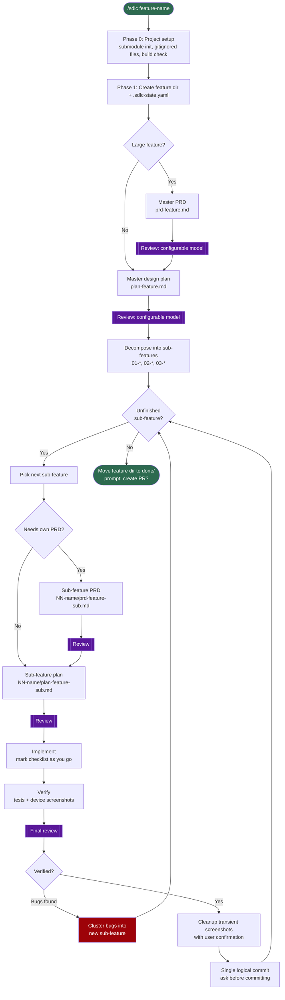
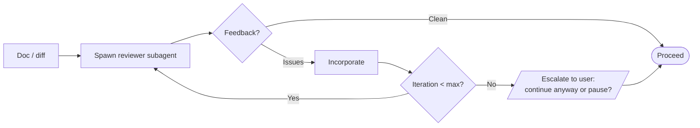

# Design: SDLC Skill + Feature Grouping

> Orchestration skill that chains the full agentic SDLC (PRD→Plan→Review→Implement→Verify→Review) with pluggable reviewer configuration, plus feature-based directory grouping for related docs.

**Design Goal:** Optimize for fast human reading + agent effectiveness + persistent progress tracking

**Issue:** upgrade-to-sdlc-nfeaturegrouping-jul26
**Branch:** `upgrade-to-sdlc-nfeaturegrouping-jul26`
**Status:** Done — closed 2026-07-29

**Sub-plans spawned from this design:**
- [x] `.feature-plans/pending/sdlc-skill-feature-grouping/01-directory-structure.md` — Feature grouping + directory refactor
- [x] `.feature-plans/pending/sdlc-skill-feature-grouping/02-format-enforcement.md` — Plan format rules + transient screenshots
- [ ] `.feature-plans/pending/sdlc-skill-feature-grouping/03-sdlc-orchestration.md` — SDLC skill with pluggable reviewer
- [x] `.feature-plans/pending/sdlc-skill-feature-grouping/04-coding-skill.md` — Generic coding skill + rename `guardrails` → `coding-agent-guardrails`
- [ ] `.feature-plans/pending/sdlc-skill-feature-grouping/05-execution-modes.md` — Execution modes (replan, handoff, park) + evals

---

## Problem

- Repetitive manual workflow: PRD → plan → opus review → adjust → implement → verify → opus review → adjust
- No skill automates the full SDLC chain — user must invoke each step manually
- Reviewer model (opus) is hardcoded in user workflow — not configurable per-CLI or per-project
- Related docs (prd, plans, sub-plans) for a feature scatter across `pending/`, `wip/`, `done/` — no feature grouping
- Plan format allows prose paragraphs — agents drift from bullet/table/visual style
- PRD requirements are overly verbose — hard to scan, slow to comprehend
- Device verification screenshots have no lifecycle — accumulate in repo or are lost
- Implementing agents don't mark checklist items — progress not persisted, no todo list for resume

---

## Out of Scope

- CI/CD integration (GitHub Actions, etc.)
- Multi-repo orchestration
- Auto-merge or auto-PR after review
- Non-Claude CLI adapters for SDLC skill (Cursor, Gemini) — future phase

---

## Requirements

### Functional

| # | Requirement |
|---|-------------|
| F1 | New `sdlc` skill orchestrates full chain: PRD → Plan → Review → Implement → Verify → Review |
| F2 | Reviewer model is pluggable — project config or CLI flag overrides default |
| F3 | Feature-based directory grouping: `.feature-plans/pending/<feature>/` contains all related docs |
| F4 | Directory moves with feature state: `pending/<feature>/` → `wip/<feature>/` → `done/<feature>/` |
| F5 | **All docs (PRD, plan, sub-plans):** bullets, tables, code, diagrams only — NO prose paragraphs |
| F6 | **PRD requirements:** crisp, focused, one line per requirement — NO verbose descriptions |
| F7 | **Checklist discipline:** implementing agent MUST mark items `[x]` as completed — persistent progress |
| F8 | Screenshots **transient by default** — gitignored, never committed unless explicitly opted in |
| F9 | SDLC skill is opt-in — existing planning/prd skills work standalone |
| F10 | Feature decomposes into sub-features; each runs its own plan→impl→verify loop |
| F11 | Sub-feature may have its own PRD when master PRD doesn't cover it |
| F12 | Bugs found in verification cluster into ONE new sub-feature — no per-bug plans |
| F13 | Subagent execution is in-harness by default; meta-harness delegation is explicit, never inferred |

### Non-functional

| # | Requirement | Target |
|---|-------------|--------|
| N1 | Backward compatibility | Existing flat-file workflows remain valid |
| N2 | Adapter coverage | Claude Code adapter supports SDLC skill on initial release |
| N3 | Config discoverability | Reviewer + screenshot config documented in SKILL.md |

---

## System Context

```
┌─────────────────────┐
│   User / Agent      │
│   (invokes /sdlc)   │
└──────────┬──────────┘
           │
           ▼
┌─────────────────────┐     ┌─────────────────────┐
│   sdlc skill        │────▶│   prd skill         │
│   (orchestrator)    │     └─────────────────────┘
│                     │     ┌─────────────────────┐
│                     │────▶│   planning skill    │
│                     │     └─────────────────────┘
│                     │     ┌─────────────────────┐
│                     │────▶│   Reviewer Agent    │
│                     │     │   (pluggable model) │
│                     │     └─────────────────────┘
│                     │     ┌─────────────────────┐
│                     │────▶│  coding-agent-      │
│                     │     │  guardrails skill   │
└─────────────────────┘     └─────────────────────┘
           │
           ▼
┌─────────────────────────────────────────────────┐
│  .feature-plans/<state>/<feature>/              │
│    ├── prd-<feature>.md                         │
│    ├── plan-<feature>.md                        │
│    └── NN-<subfeature>/                         │
│         ├── plan-<feature>-<subfeature>.md      │
│         └── screenshots/ (transient|permanent)  │
└─────────────────────────────────────────────────┘
```

- **sdlc skill** — orchestrator; invokes prd, planning, reviewer, coding-agent-guardrails in sequence
- **prd / planning / coding-agent-guardrails** — existing skills; no changes to core logic
- **Reviewer Agent** — spawned subagent with configurable model (default: opus)
- **Feature directory** — groups all artifacts; moves atomically through states

---

## Entities & Modules

| Entity / Module | Layer | Responsibility | Key Dependencies |
|-----------------|-------|----------------|-----------------|
| `skills/sdlc/SKILL.md` | Skill | Orchestration instructions + config schema | prd, planning, coding-agent-guardrails |
| `skills/sdlc/PHASES.md` | Skill | Per-phase agent behavior (linked from SKILL.md) | — |
| `skills/planning/FORMAT.md` | Skill | Updated format rules (no paragraphs, visual-only) | — |
| `.vibekit.yaml` | Config | Project-level config (reviewer model, screenshot policy) | — |
| `adapters/claude-code/install.sh` | Adapter | Installs sdlc skill to `~/.claude/skills/sdlc/` | — |

---

## Alternatives Considered

| Option | Summary | Pros | Cons | Verdict |
|--------|---------|------|------|---------|
| **A — Single SDLC skill** | One skill orchestrates all steps | Simple, one entry point | Large skill file; tight coupling | ✅ Chosen |
| **B — Workflow script** | External shell/JS orchestrator | CLI-agnostic | Not portable; config duplication | ❌ Rejected |
| **C — Expand planning skill** | Add SDLC phases to planning | No new skill | Overloads planning; mixing concerns | ❌ Rejected |

**Decision rationale:**
- Single skill keeps orchestration in Markdown — portable across adapters
- Pluggable config in `.vibekit.yaml` separates project-specific settings
- Existing skills remain standalone; SDLC is additive

---

## Configuration Schema

```yaml
# .vibekit.yaml (project root)
sdlc:
  runner:
    mode: auto           # auto | meta-harness | in-harness
    meta_harness: null   # null = none (default); agent-orchestrator | vibe-station | custom
    roles:               # all default in-harness; only implementer benefits from delegation
      implementer: in-harness
  reviewer:
    model: opus          # default reviewer model
    # Alternative: model: ${CLI_DEFAULT} — uses CLI's smartest model
    max_iterations: 3    # max review cycles before escalation
  screenshots:
    policy: transient    # DEFAULT — transient | permanent
    path: screenshots/   # relative to sub-feature directory
    confirm_cleanup: true # prompt user before deleting transient screenshots
```

- No `.vibekit.yaml` present → `transient` (safe default: nothing lands in git)
- `.feature-plans/.gitignore` carries `**/screenshots/`; `permanent` requires narrowing it deliberately

### Model Mapping Table

| Sentinel | Claude Code | Cursor | Gemini CLI |
|----------|-------------|--------|------------|
| `${CLI_DEFAULT}` | `opus` | `claude-sonnet` | `gemini-2.5-pro` |

- **model: opus** — explicit model name (portable across CLIs)
- **model: ${CLI_DEFAULT}** — sentinel value; adapter resolves per table above
- **policy: transient** (default) — gitignored; deleted after user confirmation, before commit
- **policy: permanent** — opt-in; screenshots committed to repo

### Runner: where subagents actually execute

- **In-harness** — subagent shares the caller's worktree and dies with the session
- **Meta-harness** — durable, isolated session managed by `agent-orchestrator` / `vibe-station` / custom

| Role | Interactive | Needs isolation | Default | Why |
|------|:----------:|:---------------:|---------|-----|
| Planner | **Yes** | No | in-harness | Detaching breaks the PRD/plan iteration loop |
| Reviewer | No | No | in-harness | Read-only, short-lived |
| Implementer | No | **Yes** | in-harness → meta-harness when configured | Long-running; survives session death |
| Verifier | No | No | in-harness | Needs the parent's device/emulator context |

- **Default is in-harness for every role** — no config always means in-harness
- `mode: auto` detects a harness and *suggests* it once; it never delegates on detection alone
- Only the implementer benefits from delegation; the other three are worse detached
- Runner block is **generated from the initial prompt**, then shown for approval
- Full routing, detection signals, `spawn_command` template: `03` Decision 10

### Config Discovery Order

1. Project `.vibekit.yaml` (repo root)
2. Global `~/.vibekit.yaml` (user home)
3. Hardcoded defaults in SKILL.md

---

## Feature → Sub-Feature Decomposition

- **Feature** — top-level unit; owns the master PRD + master design plan
- **Sub-feature** — the actual unit of work; owns its own optional PRD, plan, impl, verification
- Feature-level docs are written **once** and stay stable; sub-features churn

### Sub-feature origins

| Origin | Trigger | Example |
|--------|---------|---------|
| **Planned slice** | Master design spawns it upfront | `01-data-layer`, `02-api`, `03-ui` |
| **Bug bundle** | Cluster of bugs found during verification | `04-fix-nav-regressions` |
| **Requirement change** | New/clarified requirement mid-flight | `05-add-offline-mode` |
| **Specificity refinement** | Original requirement too vague to implement | `06-refine-error-states` |

### Rules

- One sub-feature = one plan = one review-implement-verify loop = one commit/PR
- Sub-feature may have its own PRD when its user-facing behavior isn't covered by the master PRD
- Bug bundles are **clustered**, not one-plan-per-bug — avoids `plan-1.1`, `plan-1.2`, `plan-1.3` sprawl
- New sub-features can be appended at any time; master design is not reopened

---

## SDLC Skill Workflow



### Loop semantics

- **Outer loop** — iterates over sub-features until the queue is empty
- **Inner cycle** — PRD (optional) → plan → review → implement → verify → review, per sub-feature
- **Bug feedback edge** — failed verification clusters bugs into a *new* sub-feature and re-enters the queue
- Every review step reads `sdlc.reviewer.model` and caps at `max_iterations` (default 3)

### Review iteration detail (applies to every `[[Review]]` node)



### Subcommands

| Command | Action |
|---------|--------|
| `/sdlc <feature>` | Start or resume SDLC workflow |
| `/sdlc status` | Show current feature + sub-feature state and next action |
| `/sdlc list` | List all features in pending/wip/done |
| `/sdlc add <name>` | Append a new sub-feature to the current feature's queue |
| `/sdlc bugs` | Cluster observed bugs into a new bug-bundle sub-feature |

### State File Schema

> **Schema authority: `03-sdlc-orchestration.md` Decision 8.** Progress lives in the plan
> checklist, NOT in per-phase state fields. Illustrative shape:

```yaml
feature: auth-flow
worktree: /path/to/worktree          # guards wrong-worktree writes
master: {prd: complete, plan: complete}
current_subfeature: 03-fix-nav-regressions
subfeatures:
  - id: 03-fix-nav-regressions
    origin: bug-bundle               # planned|bug-bundle|requirement-change|refinement
    spawned_from: 02-api
    mode: implementing               # planning|implementing|verifying|parked|handoff|cancelled|done
    last_completed: "2.3"            # resume anchor
```

- `origin` records *why* a sub-feature exists — planned slice vs reactive bug bundle
- `spawned_from` links a bug bundle back to the verification that surfaced it
- On resume: read `current_subfeature`, jump to its first non-complete phase

---

---

## Document Header Block (Required)

Every PRD, plan, and sub-plan MUST start with this header block after frontmatter:

```markdown
<!--
RULES — read before writing or implementing:
1. FORMAT: Bullets, tables, code, diagrams ONLY — no prose paragraphs
2. REQUIREMENTS: One crisp line each — no verbose descriptions  
3. CHECKLIST: Mark items [x] as you complete them — this is your persistent todo list
4. READING TIME: Optimize for fast human scanning — if it's hard to skim, rewrite it
-->
```

**Why at top of doc:**
- Implementing agent sees rules on first read
- Reviewer can verify compliance immediately
- No excuse for "didn't know the rules"

---

## Directory Structure: Before vs After

### Before (current)

```
.feature-plans/
├── pending/
│   ├── prd-auth-flow.md
│   ├── auth-flow.md
│   └── auth-flow-part2.md
├── wip/
│   └── settings-refactor.md
└── done/
    └── onboarding.md
```

### After (feature-grouped, sub-features nested)

```
.feature-plans/
├── wip/
│   └── auth-flow/                            ← feature
│       ├── .sdlc-state.yaml
│       ├── prd-auth-flow.md                  ← master PRD
│       ├── plan-auth-flow.md                 ← master design
│       ├── 01-data-layer/                    ← sub-feature (planned slice)
│       │   ├── plan-01-auth-flow-data-layer.md
│       │   └── screenshots/
│       ├── 02-api/
│       │   ├── prd-02-auth-flow-api.md       ← sub-feature PRD (optional)
│       │   └── plan-02-auth-flow-api.md
│       └── 03-fix-nav-regressions/           ← sub-feature (bug bundle)
│           └── plan-03-auth-flow-nav-regressions.md
└── done/
    └── onboarding/
        ├── .sdlc-state.yaml
        └── 01-initial/
            └── plan-01-onboarding-initial.md
```

### File naming convention

| Doc | Pattern | Example |
|-----|---------|---------|
| Master PRD | `prd-<feature>.md` | `prd-auth-flow.md` |
| Master design | `plan-<feature>.md` | `plan-auth-flow.md` |
| Sub-feature PRD | `prd-<NN>-<feature>-<subfeature>.md` | `prd-02-auth-flow-api.md` |
| Sub-feature plan | `plan-<NN>-<feature>-<subfeature>.md` | `plan-02-auth-flow-api.md` |

- **Why name-in-filename:** fuzzy-find by feature name finds every doc for that feature, regardless of which directory it sits in — filename alone is unambiguous in editor tabs, grep output, and search results
- **Why `NN` in filename too:** execution order is visible in flat search results and open editor tabs, where the parent directory isn't shown
- `NN` is assigned once and never renumbered — it's an identifier, not a position; new sub-features always append
- Simple features skip sub-feature directories — just `plan-<feature>.md` at feature root
- Screenshots live inside the sub-feature that produced them

---

## Workflow Patterns from User Memory

Patterns extracted from Claude memory files and baked into SDLC skill:

| Pattern | Source | How Enforced |
|---------|--------|--------------|
| **Bullet points only** | `feedback_concise_plans.md` | Format rules in `planning/FORMAT.md` |
| **Device coordination** | `odin_shared_device.md` | Ask user before device access |
| **Single commit per change** | `feedback_vibes_single_commit.md` | Commit strategy in `sdlc/PHASES.md` |
| **Screenshot emulator setup** | `project_screenshot_emulator_gotchas.md` | Verification checklist |
| **Worktree build setup** | `worktree_build_setup.md` | Project setup phase |
| **Opus review loop** | User request | Reviewer config + max iterations |

---

## Risks / Open Questions

| # | Question | Notes |
|---|----------|-------|
| 1 | **Backward compat for flat files?** | Support both — detect if `<slug>.md` exists vs `<slug>/` directory |
| 2 | **How does CLI signal its default model?** | Sentinel `${CLI_DEFAULT}` in config; adapter resolves per mapping table |
| 3 | **Who deletes transient screenshots?** | SDLC skill prompts user to confirm cleanup before commit |
| 4 | **What if user skips PRD step?** | SDLC skill asks user explicitly; no heuristics |
| 5 | **State tracking for resume?** | `.sdlc-state.yaml` in feature dir tracks current phase + history |
| 6 | **Max review iterations?** | 3 attempts; escalate to user after repeated rejection |
| 7 | **Concurrent features?** | Supported — each feature dir is independent; no shared state |
| 8 | **Config discovery order?** | Project `.vibekit.yaml` → global `~/.vibekit.yaml` → hardcoded defaults |
| 9 | **Migration from flat files?** | Document manual conversion; no auto-migration in V1 |

---

## Future Work: Iterative Bug Fixing + Context Management

**Problem observed:**
- Agent implements plan → misses things → bugs emerge
- User creates follow-up plans: `plan-1.1.md`, `plan-1.2.md`, `plan-1.3.md`
- If user continues in same chat → context degrades → compaction loses important context
- Fresh agent has no context; same-chat agent has polluted context

**Symptoms:**
- Plan sprawl (many small follow-up plans)
- Context window exhaustion mid-implementation
- Lost knowledge after compaction
- Repeated mistakes across sessions

**Addressed in V1 by sub-feature model:**
- Plan sprawl → bugs cluster into ONE bug-bundle sub-feature (`origin: bug-bundle`)
- Follow-up tracking → `origin` + `spawned_from` fields in `.sdlc-state.yaml`

**Addressed in `05-execution-modes.md`:**
- Handoff protocol → the plan itself is the handoff artifact (self-containment bar)
- Checkpoint → `last_completed` + committed checklist state
- Modes M1-M8 cover replan, park, scope change, post-PR feedback

**Still open (future):**
- **Context-aware compaction** — preserve plan + decisions, compact tool noise (harness-level, not skill-level)
- **Auto-detect degrading context** — signal to hand off before compaction hits
- **Implementation journal** — durable learnings that outlive a session (today these become memory files by hand)

**Status:** Not in V1 scope

---

## Sub-Plan Breakdown

This design is implemented via the following mini-designs, each owning its own phases + verification.

**Execution order is strict** — each step writes text that later steps reference by name.

| Order | Sub-plan | Scope | Why here |
|:--:|----------|-------|----------|
| 1 | [`04`](./sdlc-skill-feature-grouping/04-coding-skill.md) **Phase 0 only** | Rename `guardrails` → `coding-agent-guardrails` | Every later doc embeds the skill name — rename first or rewrite twice |
| 2 | [`01`](./sdlc-skill-feature-grouping/01-directory-structure.md) | Fix broken `scaffold.sh`; directory + naming conventions | 02/03 reference the conventions; scaffold must run for their verification |
| 3 | [`02`](./sdlc-skill-feature-grouping/02-format-enforcement.md) | Format rules, boundaries, PRD prose inversion, screenshot gitignore | Templates must be settled before the skill that invokes them |
| 4 | [`03`](./sdlc-skill-feature-grouping/03-sdlc-orchestration.md) | SDLC skill: decomposition, reviewer, state, subcommands | Creates `skills/sdlc/*`, which 02 and 05 write into |
| 5 | [`04`](./sdlc-skill-feature-grouping/04-coding-skill.md) **Phases 1-2** | Generic `coding` skill | Independent of 01-03; grouped with its own Phase 0 commit-wise |
| 6 | [`05`](./sdlc-skill-feature-grouping/05-execution-modes.md) | Execution modes M1-M8, self-containment bar, eval cases | Extends the state schema and skill files that 03 creates |

- **04 splits across the order** — Phase 0 (rename) must run first; Phases 1-2 (new skill) can run any time after
- Items targeting `skills/sdlc/*` live in `03`, never in `02` — that directory does not exist until step 4

> Each sub-plan uses the **mini-design template** and carries its own phased checklist + test verification.
> This design doc is the stable reference; sub-plans implement.

---

## Outstanding at close

Closed with the doc/skill work complete. Two sub-plans carry unchecked items, all of the
same kind — they need a **live agent session**, not more authoring:

| Sub-plan | Unchecked | What remains |
|----------|----------:|--------------|
| `03-sdlc-orchestration` | 11 | Phase 4 — end-to-end `/sdlc` behavioral validation |
| `05-execution-modes` | 5 | Phase 3.7-3.9 — eval fixtures + running E1-E33 |

- **No behavioral eval has ever been executed.** Tier A structural lint runs in CI; Tier B does not
- Re-open as a new sub-feature when running them rather than reviving this plan
