<!--
RULES — read before writing or implementing:
1. FORMAT: Bullets, tables, code, diagrams ONLY — no prose paragraphs
2. REQUIREMENTS: One crisp line each — no verbose descriptions
3. CHECKLIST: Mark items [x] as you complete them — this is your persistent todo list
4. READING TIME: Optimize for fast human scanning — if it's hard to skim, rewrite it
-->

# SDLC Planning Improvement Proposal

## Problem

- Feature plans under the wip directory are excessively long and difficult to scan.
- Severe duplication exists across planning tables (Modules & Interfaces, Files to Modify, Files Summary).
- Text blocks within plans contain long, prose-like descriptions violating the SDLC single-sentence-per-bullet rule.

---

## Strategy: Redundancy Reduction

### Table Consolidation

| Section | Current State / Redundancy | Proposed Action |
| :--- | :--- | :--- |
| **Modules & Interfaces** vs. **Files to Modify** vs. **Files Summary** | Triplication of info: the same class change is described in the Module table, the Files table, the Phase-mapping table, and the Checklist. | **Collapse** "Modules & Interfaces", "Files to Modify", and "Files Summary" into a single consolidated **Files & Phase Impact** table. |
| **Problem** & **Concept** | Often copies large portions of the master PRD verbatim. | **Abbreviate to 1-2 lines** pointing directly to the master PRD (e.g., `See [prd-name.md](file://...) for user-facing behavior`). |

---

## Plan Flow Architecture

```mermaid
graph TD
    subgraph Current Redundant Flow
        C1[PRD: Problem & Concept]
        C2[Plan: Problem & Concept repeated]
        C3[Modules & Interfaces Table]
        C4[Files to Modify Table]
        C5[Implementation Checklist]
        C6[Files Summary Table]
        C1 -.-> C2
        C2 -.-> C3
        C3 -.-> C4
        C4 -.-> C5
        C5 -.-> C6
    end

    subgraph Proposed Streamlined Flow
        P1[PRD: Source of Truth]
        P2[Plan: Direct PRD Links]
        P3[Files & Phase Impact Table]
        P4[Implementation Checklist]
        P1 -.-> P2
        P2 -.-> P3
        P3 -.-> P4
    end
```



---

## Proposed Consolidated Section: Files & Phase Impact

### Table Format

```markdown
## Files & Phase Impact

| File | Status | Phase | Description / Contract Change |
| :--- | :--- | :--- | :--- |
| `path/to/File.ext` | **Modified** | 1.2 | Contract: `funcName(x: Int): String` — handles fallback computation · Owns: nothing (pure) |
| `path/to/NewClass.kt` | **New** | 1.1 | Contract: exposes state via `stateFlow` · Owns: write lock |
| `path/to/NewClassTest.kt` | **New** | 1.T1 | Unit tests for Class operations |
```

- **Convention (resolves Open Question 1, decision b):** when a row's change is more than
  trivial, prefix the Description cell with `Contract: <signature/shape>` and, when the file
  owns any state/lock, append `· Owns: <state>`. Rows with no interface/ownership implication
  (most test files, config tweaks) skip the convention and just describe the change in one
  clause — don't force it everywhere.

---

## Writing Style Standards

### Sentence Trimming Examples

| Element Type | Current Verbose Style (Long sentences/Meta-commentary) | Proposed Streamlined Style (SDLC Compliant) |
| :--- | :--- | :--- |
| **Requirement** | "Implement a fallback mechanism where if the ScreenScraper query returns null, the fetcher will wait and try to scrape the next available source in the priority list, specifically IGDB if enabled in the user settings." | "Scrape fallback: query next enabled source in priority order if prior source has no candidate." |
| **Key Decision** | "Decision 3: We will keep one single enum type instead of creating a second enum to avoid duplicating mapping code, but we must validate at the repository level that CUSTOM is never saved to candidates." | "Decision 3: Keep single `MetadataSource` enum; enforce scraped-only validation inside repositories." |
| **Checklist Item** | "- [ ] Update `MetadataWorker.kt` line 63 and 83 where the old orchestrator was called, replacing it with the new `MetadataFetchExecutor` so that routine scrapes use the fallback sequence." | "- [ ] Update `MetadataWorker.kt:63,83` to invoke `MetadataFetchExecutor`." |

---

## Review Notes _(added during proposal review — direct-1, pre-implementation)_

Line numbers below were re-verified against the live skill files (installed copy at
`~/.claude/skills/planning/` is byte-identical to the vibekit source, so this is
authoritative). Several corrections were made to the original draft:

- **Arch-template collateral damage avoided.** `SECTIONS.md` L71-78 and L187-200 document
  *both* the plan-side (`Modules & Interfaces`) and arch-side (`Entities & Modules`) tables.
  `_template_arch.md:86` still has its own `## Entities & Modules` section and is **not**
  touched by this proposal — so these sections must be *edited*, not deleted wholesale, or
  arch loses its documentation as a side effect.
- **Fixed a wrong line reference.** "Item 7" (`Entities & Modules`) in the Plan structure
  list is at SECTIONS.md line 17, not inside the originally-cited `L20-23` range (which
  actually spans items 10-13). Split into precise, non-overlapping targets below.
- **Added the renumbering step** the original draft omitted — deleting items 10 and 13 from
  a 1-13 list leaves gaps.
- **Narrowed the FORMAT.md banned-list edit to L47 only.** L48 is a distinct, unrelated
  banned-item (file paths + line numbers for code refs) that a naive `L47-48` range-replace
  would have deleted. Also note: L47 already reads "one sentence max; use sub-bullets if more
  is needed" — nearly identical to the proposed rewrite. This edit is now cosmetic/low-value;
  consider dropping it and treating the actual gap as an enforcement problem, not a wording
  problem.
- **Narrowed the FORMAT.md checklist edit to L133 only** — L134 is a distinct, unrelated
  checklist item ("File paths include line numbers where specific").
- **Added two missing targets:** the Problem/Concept PRD-abbreviation change had no concrete
  file/line target, and `SKILL.md:51` ("Tables for files-to-modify and risks") goes stale once
  the tables are renamed but wasn't in the original update list.

---

## Decisions _(resolved — both open questions closed by the user)_

1. **Interface/ownership info loss → Option (b).** Fold a `Contract: ... · Owns: ...`
   convention into the Description column instead of a dedicated column or accepting the
   loss outright. See the updated table format above and its convention note. `SECTIONS.md`'s
   new `Files & Phase Impact` subsection (Concrete Skill Updates, below) must document this
   convention explicitly — it's not self-evident from the table header alone.
2. **Reading-flow tradeoff → accepted.** Confirmed acceptable that `Files & Phase Impact`
   only appears at the end of the plan (after Implementation Phases, since it needs phase
   numbers) and there's no more up-front interface preview before the reader reaches the
   phases. No template change needed for this beyond what's already in Concrete Skill Updates.

---

## Additional Findings _(from scanning real recent plans — direct-1, ranked by impact)_

Scanned 4 recently-completed plans from `per-game-metadata-management` (the same project the
proposal's Problem statement was drawn from). These are redundancy/verbosity patterns **not**
already covered by Table Consolidation or the sentence-trimming rule above — new findings only.

1. **Post-hoc process narrative bloats the plan body — biggest finding, currently ungoverned.**
   Every plan checked has one or more large prose sections appended outside the template
   entirely: `## Post-implementation notes`, `## Post-implementation Code Review`, `## Plan-Review
   Findings Applied`, `## Categories verified CLEAN`. One plan's post-implementation notes alone
   ran ~10 paragraph blocks (session handoffs, reviewer-finding tallies, device-verification
   narration) — the single largest prose block in the file, a direct violation of "bullets/tables
   only." No current rule says where this content belongs. **Fix:** ban it from the plan body;
   route to commit messages or a separate review artifact, plan keeps a one-line `Status:` note.
2. **Key Decision blocks absorb the review debate, not just the decision.** `#### Decision N`
   blocks run 4-8 sub-bullets weaving in "(plan review, BLOCKING 1)", corrected-reasoning
   asides, rejected alternatives — a decision record plus its entire review back-and-forth in
   one block. **Fix:** Decision blocks stay Decision/Rationale/Where only; review debate goes
   wherever #1's artifact goes.
3. **Same invariant restated 3-4+ times across unrelated sections** — real content duplication,
   distinct from the three-table pattern. E.g. one master plan states "no FK from table A to
   table B" in the Data Model row, the Architecture Diagram note, a full Key Decision, *and*
   a Risk entry. **Fix:** state once in Key Decisions, cross-reference elsewhere (`— see
   Decision 4`) instead of re-deriving.
4. **Master/root-level Files-to-Modify / Files Summary tables are empty pointer tables** once a
   feature decomposes into sub-plans — they say "see sub-plan" and add an index, not
   information the Sub-Plan Breakdown table doesn't already give. **Fix:** once Files & Phase
   Impact lands, master/root plans with a Sub-Plan Breakdown should omit their own Files &
   Phase Impact table entirely — one line pointing at Sub-Plan Breakdown instead. This is a
   direct extension of the current consolidation work, not a separate effort.

---

## Concrete Skill Updates

### 1. Planning Skill Updates

| File to Update | Target Locations (Line / Section) | Update Action |
| :--- | :--- | :--- |
| [FORMAT.md](file:///home/gb/.claude/skills/planning/FORMAT.md) | `L133` only (Checklist before committing) | Replace `- [ ] Files summary table present (includes test files)` with `- [ ] Files & Phase Impact table present (includes test files and contract changes)`. **Do not touch L134** (unrelated item: "File paths include line numbers where specific"). |
| [SECTIONS.md](file:///home/gb/.claude/skills/planning/SECTIONS.md) | `L17` (item 7, `Entities & Modules`) | Reword to `**Modules & Interfaces / Entities & Modules** — table with public interface column (plan: folded into Files & Phase Impact; arch: kept as-is)` — do not delete; arch still needs this list entry. |
| [SECTIONS.md](file:///home/gb/.claude/skills/planning/SECTIONS.md) | `L20` (item 10, `Files to Modify`) | Delete this list item. |
| [SECTIONS.md](file:///home/gb/.claude/skills/planning/SECTIONS.md) | `L23` (item 13, `Files Summary`) | Replace with `**Files & Phase Impact** — Table: file → status → phase → description/contract change`. |
| [SECTIONS.md](file:///home/gb/.claude/skills/planning/SECTIONS.md) | Whole Plan structure list (post-edit) | **Renumber** 1-13 → 1-11 after the two deletions above. |
| [SECTIONS.md](file:///home/gb/.claude/skills/planning/SECTIONS.md) | `L71-78` (`## Modules & Interfaces (plan) / Entities & Modules (arch)`) | **Edit, don't delete** — retitle to `## Entities & Modules (arch)`, keep the arch table/example, remove only the plan-specific framing. Add a short pointer: "Plan-side module/interface info now lives in `Files & Phase Impact` — see below." |
| [SECTIONS.md](file:///home/gb/.claude/skills/planning/SECTIONS.md) | `L187-200` (`## Modules vs Data Model`) | **Edit, don't delete** — update the `Modules & Interfaces (plan)` row in the comparison table to point at `Files & Phase Impact` instead of removing the section; the Entity-vs-Module distinction is still load-bearing for arch. |
| [SECTIONS.md](file:///home/gb/.claude/skills/planning/SECTIONS.md) | New subsection (near where `## Modules & Interfaces` used to be) | Add instructions + sample structure for `Files & Phase Impact`, including the `Contract: ... · Owns: ...` convention from Decision 1. |
| [_template_plan.md](file:///home/gb/.claude/skills/planning/_template_plan.md) | `L83-99` (`## Modules & Interfaces` block, through the blank line before `---`) | Delete the entire block. |
| [_template_plan.md](file:///home/gb/.claude/skills/planning/_template_plan.md) | `L212-217` (`## Files to Modify` block) | Delete the entire block. |
| [_template_plan.md](file:///home/gb/.claude/skills/planning/_template_plan.md) | `L285-296` (`## Files Summary` block, EOF) | Replace with the `## Files & Phase Impact` table markdown placeholder. |
| [_template_plan.md](file:///home/gb/.claude/skills/planning/_template_plan.md) | `L45-49` (`## Concept`) | Add a line: `- For larger features, 1-2 lines max — link the master PRD instead of restating it (e.g. "See [prd-name.md](path) for user-facing behavior")`. |
| [_template_plan.md](file:///home/gb/.claude/skills/planning/_template_plan.md) | `L35-39` (`## Problem`) | Same PRD-link guidance as Concept, for features with a master PRD. |

### 2. Writing Style Standards Updates

| File to Update | Target Locations (Line / Section) | Update Action |
| :--- | :--- | :--- |
| [FORMAT.md](file:///home/gb/.claude/skills/planning/FORMAT.md) | `L47` only (Format rules — banned) | *Optional/low-value* — L47 already says "one sentence max; use sub-bullets if more is needed," nearly identical to the proposed rewrite. If keeping the edit: `- **Inline explanations** — strictly max one sentence per bullet. Use nested sub-bullets for supplementary context.` **Do not touch L48** (unrelated: file paths + line numbers for code refs). Consider dropping this edit in favor of enforcement (see below). |
| [SKILL.md](file:///home/gb/.claude/skills/planning/SKILL.md) | `L48-52` (How to use → FORMAT.md bullet list) | Add check: `Enforce single-sentence constraint during plan review phase.` Also update `L51` (`Tables for files-to-modify and risks`) → `Files & Phase Impact table for files/phases/contracts` — otherwise this line goes stale once the tables are renamed. |
| [FORMAT.md](file:///home/gb/.claude/skills/planning/FORMAT.md) or [SECTIONS.md](file:///home/gb/.claude/skills/planning/SECTIONS.md) | New — no destination in original draft | Insert the **Sentence Trimming Examples** table (Requirement/Key Decision/Checklist Item before/after) as a concrete example block, since it's currently only illustrative in this proposal and wouldn't otherwise reach the actual skill docs. |

### 3. Additional-Findings Updates _(new — from the real-plan scan above)_

| File to Update | Target Locations (Line / Section) | Update Action |
| :--- | :--- | :--- |
| [FORMAT.md](file:///home/gb/.claude/skills/planning/FORMAT.md) | `L48` area (Format rules — banned, append after existing bullets) | Add: `- **Post-hoc process narrative** — review-round notes, handoff summaries, device-verification play-by-play; these belong in commit messages or a separate review artifact, not the plan body.` (Finding 1) |
| [FORMAT.md](file:///home/gb/.claude/skills/planning/FORMAT.md) | Same location, next bullet | Add: `- **Restating the same fact in multiple sections** — state an invariant once (typically in Key Decisions) and cross-reference elsewhere (e.g. "— see Decision 4"), don't re-derive it.` (Finding 3) |
| [SECTIONS.md](file:///home/gb/.claude/skills/planning/SECTIONS.md) | `L181-183` (Design Details → Key Decisions → Rules) | Add: `- A Decision block holds the final decision only — not the review debate that produced it (BLOCKING findings, rejected alternatives); route that to wherever Finding 1's artifact lives.` (Finding 2) |
| [SECTIONS.md](file:///home/gb/.claude/skills/planning/SECTIONS.md) | New `Files & Phase Impact` subsection (same one Decision 1 targets, item 8 above) | Add: master/root plans with a populated `Sub-Plan Breakdown` table replace their own `Files & Phase Impact` table with one line pointing at it — don't duplicate an index Sub-Plan Breakdown already provides. (Finding 4) |
| [_template_plan.md](file:///home/gb/.claude/skills/planning/_template_plan.md) | `L285-296` replacement block (same edit as item 11 above) | The `## Files & Phase Impact` placeholder gets a one-line HTML-comment reminder of the master/root exception from Finding 4, so it survives into every new plan generated from the template. |
