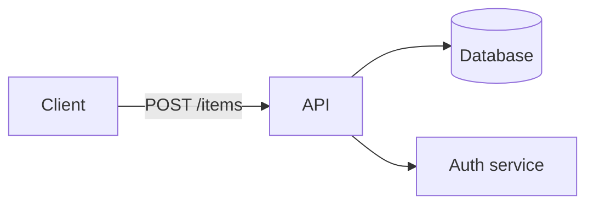
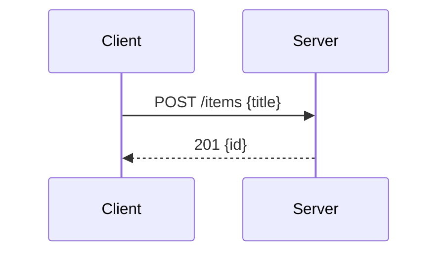
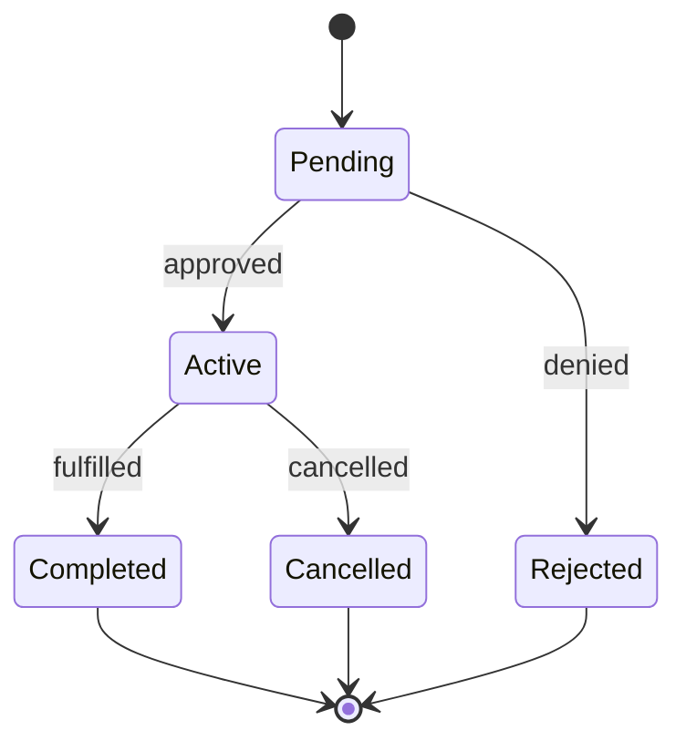
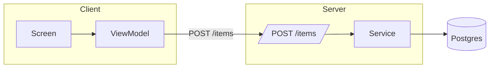

# Feature plan format — per-section templates

> Writing rules (header block, banned/allowed elements, checklist, boundaries) live in [`FORMAT.md`](./FORMAT.md). This file covers what each section of the plan contains.

---

## Plan structure

All plans follow this structure (see `_template_arch.md` / `_template_plan.md`):

1. **Frontmatter** — Issue, Branch, Status, PRD link
2. **Problem** — 1-3 bullets: what's broken / missing (link the master PRD instead of restating it, when one exists)
3. **Concept** — High-level user-facing behavior (link the master PRD instead of restating it, when one exists)
4. **Requirements** — Numbered table
5. **Research** — Bullet-point findings with file paths + line numbers
6. **Architecture Diagram** — boundary diagram (mermaid `flowchart`); one line if single-module
7. **Modules & Interfaces / Entities & Modules** — table with public interface column (plan: folded into Files & Phase Impact, see below; arch: kept as-is)
8. **Architecture** — Single diagram showing all components and connections
9. **Design Details** — CUJs, System Boundaries, Data Model, API Contracts, Key Decisions
10. **Risks / Open Questions** — Table: `| # | Question | Notes |`
11. **Implementation Phases** — Phased checklist with test verification blocks
12. **Files & Phase Impact** — Table mapping file → status → phase → description/contract change

---

## Implementation phases and test verification

- Every phase ends with a **`Verify phase N:`** block — the phase is not done until those tests pass
- Implementation items: `N.1`, `N.2` … · Test items: `N.T1`, `N.T2` … (T prefix distinguishes them)
- Test files belong in the Files & Phase Impact table alongside source files
- "Write tests" without a class name or assertion is not a valid test item — be specific

```markdown
- [ ] **1.T1** Unit — `ClassName`: [specific assertion, e.g. "returns null on empty input"]
- [ ] **1.T2** Integration — `[flow name]`: [trigger → expected outcome]
- [ ] **1.T3** Regression — `[existing flow]`: [behavior that must still pass]
```

| Type | Scope | When to use |
|------|-------|-------------|
| **Unit** | Single class / function in isolation | Pure logic, data transformations, state machines |
| **Integration** | Multiple components or system boundary | Persistence, navigation, real repositories, UI + state |
| **Regression** | Previously passing flow | Any time an existing behavior could be affected by the phase |
---

## Tables

- Files & Phase Impact: `| File | Status | Phase | Description / Contract Change |`
- Risk matrix: `| # | Question | Notes |`
- Config/state: `| Variant | Current | Target |`
- Options: `| Option | Pros | Cons |`
- Keep cells short; bullets inside a cell only if needed

---

## Architecture Diagram

- Required whenever the change crosses a module boundary; pure single-module change → one line saying so, no diagram
- Big feature: full system boundary diagram (client/server/DB/3rd-party)
- Small feature: the touched modules + their neighbours only, not the whole system


---

## Entities & Modules (arch)

> Plan-side module/interface info now lives in the **Files & Phase Impact** table (see below) —
> this section covers only the arch-level `Entities & Modules` table.

Declares a **public interface**, not just a dependency list — that's what gets invented badly when missing.
| Module | Responsibility | Public interface | Owns |
|--------|---------------|------------------|------|
| `BackupSerializer` | Config → bytes | `serialize(Config): Result<ByteArray>` | nothing (pure) |
| `RestoreCoordinator` | Apply a backup transactionally | `restore(ByteArray): Result<Unit>` | write lock |
---

## Files & Phase Impact (plan)

Replaces the old `Modules & Interfaces` / `Files to Modify` / `Files Summary` trio with one
table, positioned where `Files Summary` used to be (after Implementation Phases — it needs
phase numbers, which don't exist until the phases are written).

| File | Status | Phase | Description / Contract Change |
|------|--------|-------|-------------------------------|
| `path/to/File.ext` | **Modified** | 1.2 | Contract: `funcName(x: Int): String` — handles fallback computation · Owns: nothing (pure) |
| `path/to/NewClass.kt` | **New** | 1.1 | Contract: exposes state via `stateFlow` · Owns: write lock |
| `path/to/NewClassTest.kt` | **New** | 1.T1 | Unit tests for Class operations |

- **Status** is `New` / `Modified` / `Unchanged` — an implementer must not have to guess which
- **Convention:** when a row's change is more than trivial, prefix Description with
  `Contract: <signature/shape>` and, if the file owns state/a lock, append `· Owns: <state>`.
  Rows with no interface/ownership implication (most test files, config tweaks) skip the
  convention and just describe the change in one clause — don't force it everywhere
- **Master/root exception:** a master or root plan with a populated `Sub-Plan Breakdown` table
  (see `_template_plan.md`) replaces its own Files & Phase Impact table with one line pointing
  at Sub-Plan Breakdown — don't duplicate an index that table already provides
---

## Diagrams — pick what communicates best

- **Goal: make it clear and good-looking.** These are defaults, not a cage — a richer diagram that reads better always wins
- **Rule:** if the reader would hold >3 relationships in their head, draw it
- Name interfaces on the edges — `Client --POST /items--> API`, not `Client --> API`
- Mermaid may use `subgraph`, `classDef`, styling — use them when they aid comprehension

| Intent | Good default | Why |
|--------|-------------|-----|
| System/module boundaries | `mermaid flowchart` + `subgraph` per layer | Renders anywhere; survives renaming |
| Sequence across layers (CUJ) | `mermaid sequenceDiagram` | Shows who calls whom, in order |
| State machine / lifecycle | `mermaid stateDiagram-v2` | Transitions are explicit |
| Entity relationships | `mermaid erDiagram` | Cardinality is explicit |
| Trivial linear flow | ASCII `A → B → C` | Mermaid adds nothing |
| Data shape / field lists | **Table** | Not a diagram — don't draw it |
| Directory layout | ASCII tree | Mermaid does this badly |





---

## Design Details → Critical User Journeys (CUJs)

- CUJs are the first subsection inside **Design Details**
- Write one block per distinct user path. Required:

- **Happy path** — the normal success flow, step by step
- **Error / edge-case paths** — at least one (validation failure, auth block, empty state, network error)

CUJ format:
```
User opens [screen]
  → Takes [action]
  → System does X
  → User sees [state]
  → Outcome
```

**When a snippet earns its place:**
- An ordering constraint, lifecycle trap, concurrency or rollback pattern
- An API shape the implementer would otherwise have to invent
- Not for boilerplate the reader could write from the description alone
- Always comment what the snippet demonstrates — a bare snippet makes the reader guess

Rules:
- Use ASCII flow (indented `→`) for a simple sequence, `mermaid sequenceDiagram` for a multi-layer one
- Follow each flow with 2-3 bullets for error/edge paths
- Cover the paths that drive architectural decisions — don't add CUJs for flows that don't affect design

---

## Design Details → API Contracts

Write one contract block per endpoint or interface boundary — same rules as `FORMAT.md`'s System Boundaries section:
- REST: method + path, request body, response shape, error codes
- GraphQL: mutation/query name, variables, return type, errors
- RPC / internal service: method name, input type, output type, errors
- Event / message: topic name, payload schema, producer → consumer

Rules:
- Show field names and types — not just "a JSON object"
- List all error codes the caller must handle
- If a contract already exists and isn't changing, say so in one line — don't repeat it

---

## Design Details → Key Decisions

- One `####` subsection per decision — applies to both new features and bug fixes
- Typical topics: error handling, auth/permission boundary, caching/invalidation, offline/sync, concurrency, security boundary, rate limiting, observability

Format:
```markdown
#### Decision N: [Short title]
- **Decision:** what was chosen
- **Rationale:** why (tradeoff / constraint)
- **Where:** `file.ext:line` — what changes
\`\`\`
// include when the tricky part is the SHAPE of the code — ordering, lifecycle, easy-to-get-wrong
\`\`\`
```

Rules:
- Every non-trivial design choice gets its own entry — don't bury it in prose
- Code snippet is optional; include only when the pattern wouldn't be clear from the description
- "Where" must have a file path — if it spans files, list each one
- A Decision block holds the final decision only — not the review debate that produced it (BLOCKING findings, rejected alternatives); route that to commit messages or a separate review artifact, not the plan

---

## Modules vs Data Model — not the same thing

| Section | Answers | Columns |
|---------|---------|---------|
| **Files & Phase Impact** (plan) | what code this change creates/modifies, plus its interface/contract | File, Status, Phase, Description / Contract Change |
| **Entities & Modules** (arch) | the system's components at design time | Entity/Module, Layer, Responsibility, Interface, Dependencies |
| **Data Model** | what is *persisted* and its shape | Entity, Field, Type, Constraints |

- A module is a unit of behavior; an entity is a unit of storage
- A feature can touch modules and persist nothing, or add a column without a new module
- The plan-side table (formerly "Entities & Modules," then "Modules & Interfaces") is now **Files & Phase Impact** — file-centric instead of module-centric, since that's what an implementer actually executes against
- **"Module" is project-relative** — class, package, service, or file, whichever this codebase names in review. Define it once, use it consistently
- **Every Files & Phase Impact row carries a `Status` marker** (`New`/`Modified`/`Unchanged`) — without it the reader cannot tell what is being proposed from what already exists
- Arch keeps `Entity / Module` because a system-level view legitimately lists datastores as components

---

## Architecture section

- Components and connections — **no prose, no decisions** (those belong in Design Details)
- A short legend or one-line component note is fine; a paragraph is not



Rules:
- **As many diagrams as earn their place** — one is typical; add a sequence or state view when it genuinely helps
- Show every major component this feature touches
- ASCII `→` flows are fine for trivial cases and inside CUJs / Key Decisions

---

## Data Model

Use the table format in the template (Entity / Field / Type / Constraints / Notes). Required:
- Every entity involved in the feature
- Every field being added, changed, or removed
- FK relationships, uniqueness constraints, indexes
- Migration note: Y (what changes + backfill strategy) or N
