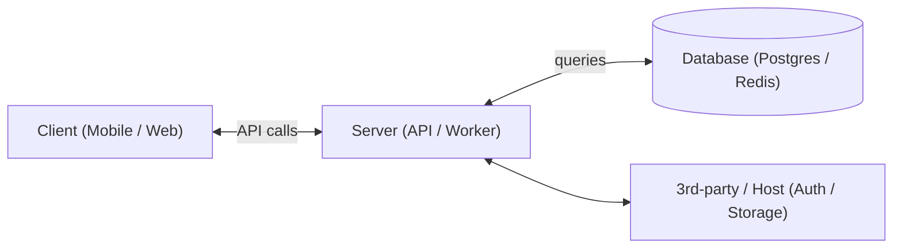

<!--
RULES — read before writing or implementing:
1. FORMAT: Bullets, tables, code, diagrams ONLY — no prose paragraphs
2. REQUIREMENTS: One crisp line each — no verbose descriptions
3. CHECKLIST: Mark items [x] as you complete them — this is your persistent todo list
4. READING TIME: Optimize for fast human scanning — if it's hard to skim, rewrite it
-->

# Arch: [System / Feature Name]

> One-line description of what this system/feature does and why it exists.

**Issue:** [issue-slug]
**Branch:** `feat/[branch-name]`
**Status:** Pending | WIP | Done
**PRD:** `.feature-plans/pending/prd-<slug>.md`

**Parts spawned from this arch:**
- [ ] `.feature-plans/pending/<feature>/01-<slug>/plan-01-<feature>-<slug>.md` — [short title]
- [ ] `.feature-plans/pending/<feature>/02-<slug>/plan-02-<feature>-<slug>.md` — [short title]
- [ ] `.feature-plans/pending/<feature>/03-<slug>/plan-03-<feature>-<slug>.md` — [short title]

---

## Superseded _(only present after an M4 replan — omit on first draft)_

| Prior approach | Why it failed | Superseded on |
|-----------------|---------------|---------------|
| One-line summary of the old approach | One-line reason | date / commit |

---

## Problem

- What gap or pain this design addresses (2-4 bullets)
- Who is affected and at what scale
- Why solving it now matters

## Out of Scope

- Explicit list of adjacent problems this design does NOT address
- Future phases / follow-up work
- Known non-goals

---

## Requirements

### Functional

| # | Requirement |
|---|-------------|
| F1 | |
| F2 | |

### Non-functional

| # | Requirement | Target |
|---|-------------|--------|
| N1 | Latency | p99 < Xms |
| N2 | Throughput | Y req/s |
| N3 | Availability | Z nines |
| N4 | Security / Auth | |
| N5 | Privacy / Data retention | |

---

## Architecture Diagram

High-level boundary diagram — who talks to what.



- **Client** — [responsibilities, e.g. renders UI, local state, optimistic updates]
- **Server** — [responsibilities, e.g. business logic, auth enforcement, orchestration]
- **Database** — [what's stored, consistency requirements]
- **3rd-party / Host** — [what's delegated, trust boundary]

---

## Entities & Modules

| Entity / Module | Layer | Responsibility | Public interface | Key Dependencies |
|-----------------|-------|----------------|-------------------|-----------------|
| `EntityA` | DB | Source of truth for X | — | — |
| `ServiceB` | Server | Orchestrates X → Y | `handle(Input): Result<Output>` | `EntityA`, `ServiceC` |
| `ServiceC` | Server | Handles Z | `process(Z): Result<Unit>` | `EntityA` |
| `StoreD` | Client | Local cache + optimistic state | `observe(): Flow<State>` | `ServiceB` (via API) |
| `ViewModelE` | Client | Transforms store state for UI | `uiState: StateFlow<UiState>` | `StoreD` |

---

## Alternatives Considered

| Option | Summary | Pros | Cons | Verdict |
|--------|---------|------|------|---------|
| **A — [name]** | | | | ✅ Chosen |
| **B — [name]** | | | | ❌ Rejected |
| **C — [name]** | | | | ❌ Deferred |

**Decision rationale:** 1-3 bullets on why A wins over B and C.

---

## Design Details

### System Boundaries

_Required for every boundary this design crosses — see `FORMAT.md` System Boundaries table (frontend↔backend, client↔DB, service↔service, module↔module)._

| Boundary | Fields + types | Errors | Source of truth |
|----------|----------------|--------|-----------------|
| [Frontend ↔ Backend] | `field: type, ...` | `ERR_CODE — meaning` | who owns it |
| [Service ↔ Service] | payload schema | retry/idempotency notes | who owns it |

### Critical User Journeys (CUJs)

#### CUJ 1 — [Happy path name]

```
User                Client              Server             DB
 │                    │                   │                 │
 │── tap [action] ──▶│                   │                 │
 │                    │── POST /resource ▶│                 │
 │                    │                   │── INSERT ──────▶│
 │                    │                   │◀── row ─────────│
 │                    │◀── 201 {id} ──────│                 │
 │◀── show success ───│                   │                 │
```

- Preconditions: user is authenticated, X exists
- Success: resource created, UI updates optimistically
- Error paths: → CUJ 3

#### CUJ 2 — [Secondary happy path]

```
User                Client              Server
 │                    │                   │
 │── open screen ───▶│                   │
 │                    │── GET /resources ▶│
 │                    │◀── 200 [list] ────│
 │◀── render list ────│                   │
```

#### CUJ 3 — [Error / edge case]

```
User                Client              Server
 │                    │                   │
 │                    │── POST /resource ▶│
 │                    │                   │── validation fails
 │                    │◀── 422 {error} ───│
 │◀── show inline ────│                   │
     error toast
```

- Error conditions: missing required field, duplicate, quota exceeded
- Recovery: user can retry inline without losing form state

### Data Model

#### New / Modified Tables

| Table | Field | Type | Notes |
|-------|-------|------|-------|
| `resources` | `id` | uuid PK | |
| `resources` | `status` | enum | pending / active / done |
| `resources` | `owner_id` | uuid FK → users | indexed |

- Migrations needed: Y — [brief description of migration steps]
- Backwards-compatible: Y/N — why

### API Contracts

#### Endpoints (REST) / Events (async)

| Method | Path / Topic | Request | Response | Auth |
|--------|-------------|---------|----------|------|
| `POST` | `/api/v1/resource` | `{field: type}` | `{id, status}` | Bearer |
| `GET` | `/api/v1/resource/:id` | — | `{...}` | Bearer |

#### Key Data Schemas

```
ResourceCreate {
  field_a: string        // description
  field_b: int           // description
  field_c?: string       // optional, description
}

ResourceResponse {
  id:        uuid
  status:    "pending" | "active" | "done"
  created_at: timestamp
}
```

---

## Rollout Strategy

| Stage | Audience | Gate | Success Signal |
|-------|----------|------|---------------|
| Internal alpha | Team only | flag `arch_x_alpha` | No crashes, core CUJs work |
| Beta | X% of [segment] | flag `arch_x_beta` | Retention / error rate within target |
| GA | All users | flag removed | Metrics stable for N days |

- Kill-switch: disable flag → falls back to [old behavior]
- Monitoring: [dashboard / alert names]

---

## Risks / Open Questions

| # | Question | Notes |
|---|----------|-------|
| 1 | **Short question?** | Brief answer / tradeoff |
| 2 | **Short question?** | Brief answer / tradeoff |

---

## Part Breakdown

This arch is implemented via the following parts, each owning its own phases + verification.

| Part | Scope | Dependencies |
|------|-------|-------------|
| [`01-<slug>`](./01-<slug>/plan-01-<feature>-<slug>.md) | Data model + core service | none |
| [`02-<slug>`](./02-<slug>/plan-02-<feature>-<slug>.md) | API layer | 01 done |
| [`03-<slug>`](./03-<slug>/plan-03-<feature>-<slug>.md) | Client / UI | 02 done |

> Each part uses the **plan template** and carries its own phased checklist + test verification.
> This arch doc is not re-opened once parts are drafted — it is the stable reference.
