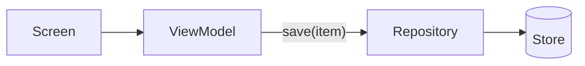

<!--
RULES — read before writing or implementing:
1. FORMAT: Bullets, tables, code, diagrams ONLY — no prose paragraphs
2. REQUIREMENTS: One crisp line each — no verbose descriptions
3. CHECKLIST: Mark items [x] as you complete them — this is your persistent todo list
4. READING TIME: Optimize for fast human scanning — if it's hard to skim, rewrite it
-->

# Plan: [Title]

> One-line description / scope statement.

**Issue:** [issue-slug]
**Branch:** `feat/[branch-name]`
**Status:** Pending | WIP | Done
**PRD:** `.feature-plans/pending/prd-<slug>.md` _(link if a PRD was written)_
**Parent:** `arch-<slug>.md` or `plan-<slug>.md` _(only when spawned)_

**Reference files:**
- Data / schema: `path/to/schema.ext`
- Core logic: `path/to/Module.ext`
- UI / entrypoint: `path/to/Entry.ext`
- Wiring (DI / routing / config): `path/to/wiring.ext`

---

## Superseded _(only present after an M4 replan — omit on first draft)_

| Prior approach | Why it failed | Superseded on |
|-----------------|---------------|---------------|
| One-line summary of the old approach | One-line reason | date / commit |

---

## Problem

- What's broken / missing (1-3 bullets)
- Who's affected and how

## Out of Scope

- Explicit list of things this plan does NOT cover
- Deferred items or follow-up work

## Concept

- 1-3 bullets describing the feature / fix at a high level
- What user-facing behavior changes
- What the success state looks like

## Requirements

| # | Requirement |
|---|-------------|
| 1 | Functional requirement |
| 2 | Non-functional / constraint |
| 3 | Rollout / gating rule |

---

## Research

- Bullet-point findings only — include file paths + line numbers, no prose

### [Code path / area name]

- **File:** `path/to/file.ext:123`
- **Trigger:** when X happens
- **Risk:** HIGH / MEDIUM / LOW — why

### [Another area]

- ...

## Root Cause

- Core issue in 1-2 bullets
- Secondary factors as sub-bullets

---


## Modules & Interfaces

_**Module** = whatever unit this project names in code review — a class, package, service, or file.
Use the project's own vocabulary, not a generic one._

_List every module this change **creates or modifies**, plus any it **depends on** whose interface
the implementer must call. Do not inventory the codebase._

| Module | Change | Responsibility | Public interface | Owns |
|--------|--------|---------------|------------------|------|
| `NewThing` | **New** | What it does | `method(Input): Result<Output>` | state it owns, or "nothing (pure)" |
| `ExistingThing` | **Modified** | What changes about it | `existing(X): Y` + `newMethod(Z): W` | unchanged |
| `Dependency` | Unchanged | Why it appears here | `consume(A): B` — called, not changed | — |

- **Change** is `New` / `Modified` / `Unchanged` — an implementer must not have to guess which they are creating
- `Unchanged` rows exist only to pin an interface being consumed; drop them if nothing is consumed

---

## Architecture Diagram

_Required when the change crosses a module boundary. Pure single-module change → one line saying so, no diagram._



- Name the interface on the edge, not just the arrow
- Add a second diagram (sequence / state) only when it genuinely helps

---

## Design Details

### System Boundaries

_Required if this plan touches more than one layer — see `FORMAT.md` System Boundaries table._

| Boundary | Fields + types | Errors | Source of truth |
|----------|----------------|--------|-----------------|
| [Frontend ↔ Backend / Client ↔ DB / Module ↔ Module] | `field: type, ...` | `ERR_CODE — meaning` | who owns it |

### Critical User Journeys (CUJs)

#### CUJ 1 — [Happy path title]

```
User opens [screen]
  → Taps [action]
  → System fetches / validates X
  → User sees [state A]
  → User confirms
  → System persists → shows success state
```

- **Error path:** what happens when X fails (network, validation, auth)
- **Edge case:** empty state / first-run / concurrent update

#### CUJ 2 — [Error / edge-case title]

```
User attempts [action] without [precondition]
  → System detects missing precondition
  → Shows [error / prompt] with recovery action
```

### Data Model

| Entity | Field | Type | Constraints | Notes |
|--------|-------|------|-------------|-------|
| `EntityName` | `id` | `UUID` | PK | |
| `EntityName` | `field` | `string` | NOT NULL | |
| `RelatedEntity` | `entity_id` | `UUID` | FK → Entity.id | |

- **Relationships:** Entity 1→N RelatedEntity; ...
- **Indexes:** `entity_id`, `(field, created_at)` for [query]
- **Migration:** Y — add `field`, backfill with `default`; or N

### API Contracts

```
POST /api/[resource]
  Request:  { field: type, ... }
  Response: { result: Type, meta: Meta }
  Errors:   400 VALIDATION_ERROR, 401 UNAUTHORIZED, 404 NOT_FOUND

GET /api/[resource]/:id
  Request:  —
  Response: { item: Type }
  Errors:   403 FORBIDDEN, 404 NOT_FOUND
```

_(One block per contract — REST endpoints, GraphQL mutations/queries, RPC methods, or internal service interfaces.)_

### Key Decisions

> Include a code sample whenever the tricky part is the **shape of the code** — an ordering
> constraint, a lifecycle trap, a pattern that is easy to get subtly wrong. Prose describing a
> pattern the implementer must then re-derive is where plans leak.

#### Decision 1: [Short title] — *with a snippet, because the pattern IS the decision*

- **Decision:** what was chosen
- **Rationale:** why (tradeoff / constraint)
- **Where:** `path/to/File.ext:123` — what changes

```kotlin
// Restore must be all-or-nothing: a back-press mid-apply previously left a half-written store.
// The lock is held across the whole apply, and rollback restores the pre-image on ANY failure.
suspend fun restore(backup: Backup): Result<Unit> = writeLock.withLock {
    val preImage = store.snapshot()
    runCatching { backup.entries.forEach { store.apply(it) } }
        .onFailure { store.restore(preImage) }   // ← the point: rollback, not partial state
}
```

- Say what the snippet is *for* in a comment — a bare snippet makes the reader guess the intent

#### Decision 2: [Short title] — *no snippet needed*

- **Decision:** what was chosen
- **Rationale:** why (tradeoff / constraint)
- **Where:** `path/to/File.ext:45` — what changes

---

## Files to Modify

| File | Change |
|------|--------|
| `path/to/file.ext` | Brief description |

## Risks / Open Questions

| # | Question | Notes |
|---|----------|-------|
| 1 | **Short question?** | Brief answer / tradeoff |

---

## Sub-Plan Breakdown _(omit if none spawned)_

This plan spawned the following sub-plans — bug bundles, requirement changes, or refinements found during implementation.

| Sub-plan | Origin | Scope |
|----------|--------|-------|
| [`NN-<slug>`](./NN-<slug>/plan-NN-<feature>-<slug>.md) | bug-bundle \| requirement-change \| refinement | one-line scope |

- `NN` is assigned once and never renumbered — new sub-plans always append
- This plan is not rewritten once a sub-plan is drafted — the sub-plan owns its own checklist

---

## Implementation Phases

- Each phase ends with a **verification block** — the phase is not complete until those tests pass
- Test items use `N.Tn` numbering (`1.T1`, `1.T2`, `2.T1` …) to distinguish them from implementation items
- Unit tests verify isolated logic; integration tests verify an end-to-end flow or boundary
- Device verification screenshots: save to `<subfeature>/screenshots/<descriptive-name>.png`, embed with `` — transient by default, gitignored (see `FORMAT.md` Screenshots)

---

### Phase 1 — [Core / Data + Logic]

- [ ] **1.1** Schema changes in `schema.ext`
- [ ] **1.2** Core logic in `Module.ext`
- [ ] **1.3** State exposure in `ViewModel.ext`

**Verify phase 1:**
- [ ] **1.T1** Unit — `ModuleTest`: [specific assertion — e.g. "returns null when input is empty"]
- [ ] **1.T2** Unit — `ViewModelTest`: [state emitted when X — e.g. "emits Loading then Success on valid input"]
- [ ] **1.T3** Integration — `[flow description]`: [trigger → expected outcome — e.g. "saving entity persists to DataStore and re-emits from Flow"]

---

### Phase 2 — [UI / Entrypoint]

- [ ] **2.1** Routing / navigation in `routing.ext`
- [ ] **2.2** UI screen + state binding in `Screen.ext`
- [ ] **2.3** DI / wiring registration in `wiring.ext`

**Verify phase 2:**
- [ ] **2.T1** Unit — `ScreenTest`: [UI renders correct state — e.g. "shows empty state when list is empty"]
- [ ] **2.T2** Integration — `[navigation flow]`: [user taps X → correct screen appears with expected state]

---

### Phase 3 — [Gating / Polish]

- [ ] **3.1** Feature flag / gating
- [ ] **3.2** Edge-case handling
- [ ] **3.3** Onboarding / docs

**Verify phase 3:**
- [ ] **3.T1** Integration — `[gating flow]`: [free-tier user sees correct locked state; paid user sees unlocked]
- [ ] **3.T2** Regression — `[existing flow]`: [previously working behavior still passes]

---

## Files Summary

| File | Phase | Change |
|------|-------|--------|
| `schema.ext` | 1.1 | Add new fields |
| `Module.ext` | 1.2 | Core logic |
| `ViewModel.ext` | 1.3 | Expose state |
| `routing.ext` | 2.1 | Add route |
| `wiring.ext` | 2.3 | Register new component |
| `ModuleTest.ext` | 1.T1 | New unit tests |
| `ViewModelTest.ext` | 1.T2 | New unit tests |
| `ScreenTest.ext` | 2.T1 | New UI tests |
