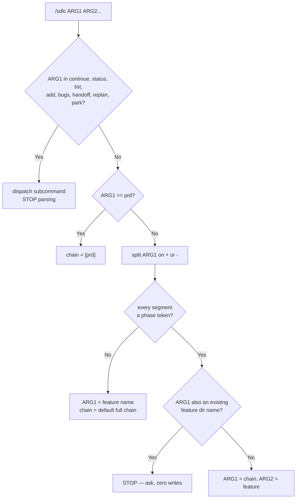
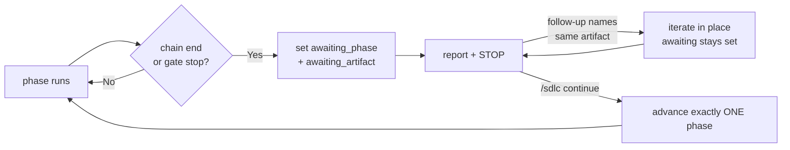

# SDLC — invocation grammar

> Read [`SKILL.md`](./SKILL.md) first for the config schema, workflow diagram, and subcommand table.
> This file is the parsing, gate, and pause rules. Read it before parsing any `/sdlc` invocation.

---

## Dispatch precedence

- Precedence is **total** — every arg-1 string resolves to exactly one branch
- Order: **subcommand → `prd` special case → chain → feature name**

- `/sdlc continue`, `/sdlc status`, `/sdlc list`, `/sdlc add`, `/sdlc bugs`, `/sdlc handoff`, `/sdlc replan`, `/sdlc park` dispatch **before** any `+`/`-` split
- `/sdlc add plan` → `add` dispatches; `plan` is its `<name>` argument, never a chain
- `continue` is a **subcommand, never a phase token** — it is the only thing that clears a pause
- **`prd` is one behavior with two spellings** — the `/sdlc prd <feature>` subcommand *is* the 1-token chain `[prd]`

---

## Parse algorithm

| Token | Alias | Artifact written | `awaiting_phase` on chain end |
|-------|-------|------------------|-------------------------------|
| `prd` | — | `prd-<feature>.md` | `prd` |
| `plan` | — | `arch-<feature>.md` (rare), `plan-<feature>.md`, or `plan-<NN>-<feature>-.md` | `plan` |
| `implement` | `impl` | source diff + `[x]` marks | `implement` |
| `verify` | — | test/device results in the plan's verify block | `verify` |
| `review` | — | reviewer report on the newest completed artifact | `review` |

- Separators `+` and `-` are interchangeable — `prd+plan` ≡ `prd-plan`
- Arg 1 is a chain **iff** it is not a subcommand **and** every separated segment is a phase token
- `/sdlc backup-restore` → `backup` is not a phase token → the whole arg is the feature name
- Canonical order: `prd` < `plan` < `implement` < `verify` < `review`
- The chain is **exhaustive and terminal** — never run a phase outside it, even after a clean review
- A near-token (`planning`, `implementation`, `plans`) is **not** a token — treat as a feature name, never fuzzy-match
- No chain given → the default full chain; behavior is unchanged from a chain-less invocation

---

## Ambiguity

- Feature dir named like a phase token (`plan/`, `prd-plan/`) → **STOP and ask** chain-vs-feature
- Ambiguity is resolved **before any write** — no file is created while the question is open
- Arg 2 missing on a chain invocation → use `current_subfeature` from the nearest `.sdlc-state.yaml`
- No state file and no arg 2 → ask which feature; never invent one
- Near-token arg naming no existing feature → say so; do not guess a phase and do not fuzzy-match

---

## Normalization

- Tokens run in canonical order regardless of typed order
- A reorder is **stated before acting**, never after and never silently
- `/sdlc implement+plan <f>` → announce "running plan, then implement" and wait one beat before the first write
- Rationale: `implement+plan` after a failed implementation plausibly means an M4 replan — announcing lets the user correct first
- Non-contiguous chain (`prd+implement`, skipping `plan`) is allowed — warn **once per invocation**, then proceed
- Duplicate tokens collapse silently — `plan+plan` ≡ `plan`

---

## Gate semantics

- `sdlc.agents.reviewer.gate` is standing policy; the chain is per-invocation scope — the two are orthogonal
- Default `llm` reproduces today's behavior exactly

| `gate` | Reviewer subagent | Stops for human | `max_iterations` applies | Reviewer-unavailable fallback |
|--------|:-----------------:|:---------------:|:------------------------:|:-----------------------------:|
| `llm` (default) | ✅ | ❌ auto-advance when clean | ✅ | ✅ warn + continue |
| `user` | ❌ | ✅ | ❌ n/a | ❌ n/a — none requested |
| `both` | ✅ | ✅ | ✅ | ✅ warn + still stop for human |

- Gate governs artifact phases **inside** a chain; the **chain end always stops**, whatever the gate
- Under `gate: user` no reviewer is requested, so "reviewer unavailable → continue without review" does not apply
- Unknown `gate` value → warn and treat as `llm`

---

## awaiting lifecycle

- Set `awaiting_phase` + `awaiting_artifact` on the sub-feature when a chain ends or a gate stops — this includes the zero-parts `root` entry, which is a sub-feature like any other
- `awaiting_phase != null` is the **do not advance** signal — `mode` is never overwritten by the pause
- Both fields are null together or non-null together; for `implement`, `awaiting_artifact` is the plan file

- **Resume** with `awaiting_phase` set → restate the awaited artifact and ask; never auto-advance
- **Follow-up prompt naming the same artifact** → iterate within that phase; `awaiting_*` stays set
- `/sdlc continue` advances **exactly one** phase, then sets `awaiting_*` again at the new stop
- `/sdlc continue` with nothing awaiting → say so, then fall through to normal M2 resume
- `awaiting_phase` **blocks the queue drain** to `done/` by design — same as `cancelled`, it is cleared deliberately
- **Terminal phase:** `review` is last — there is no phase to advance to
- `/sdlc continue` at `awaiting_phase: review`, review clean → **clears `awaiting_*`**, sets `mode: done`, releases to the drain
- `/sdlc continue` at `awaiting_phase: review`, review not clean → iterate in place; `awaiting_*` stays set
- Without that release rule the queue never empties and `done/` is unreachable
- A sub-feature that spawned a bug bundle (M5) has `awaiting_*` cleared when the bundle closes
- `/sdlc status` and `/sdlc list` surface it as `AWAITING: <phase> — <artifact>`
**A different command while a pause is outstanding:**

| Input | Effect on `awaiting_*` |
|-------|------------------------|
| `/sdlc continue` | advances one phase (or releases at `review`) |
| follow-up naming the awaited artifact | preserved — iterate in place |
| `/sdlc status`, `/sdlc list` | preserved — read-only |
| `/sdlc bugs`, `/sdlc add` | preserved on the awaiting sub-feature; the new one becomes current |
| `/sdlc park` | preserved — restored on resume |
| `/sdlc replan <awaiting sub>` | **STOP and ask** — the awaited artifact is about to be superseded |
| a chain naming the same feature | **STOP and ask** — do not silently discard the pause |

- Default for anything unlisted: **preserve `awaiting_*` and say it is still outstanding**
- `awaiting_artifact` is a repo-relative path — **rewrite it whenever the feature dir moves** (park, drain), same hazard the `worktree:` guard exists for

- The pause is **never** folded into the `mode` enum — a mode value would destroy the prior mode with nothing to restore

---

## review token

- `review` reviews the **newest completed artifact** for the sub-feature, resolved from `phase_chain` and state
- It **replaces** that phase's own gate reviewer pass — never run two passes over one artifact
- `/sdlc plan+review <f>` under `gate: llm` → exactly one reviewer pass, not two
- No artifact exists yet → **stop and ask** what to review; never create one to have something to review
- The reviewer still reads the skill that governs the artifact, per [`PHASES.md`](./PHASES.md)
