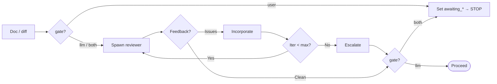

# SDLC — per-phase agent behavior

> Read [`SKILL.md`](./SKILL.md) first for the config schema, workflow diagram, and subcommand table.
> Read [`GRAMMAR.md`](./GRAMMAR.md) for invocation parsing, gate semantics, and the pause lifecycle.
> This file is the operational instructions for each phase and each execution mode.

## Skill loading (do this at each phase)

- **PRD** → read the `prd` skill (+ its `FORMAT.md`) · **Plan** → read `planning` (+ `FORMAT.md`, `SECTIONS.md`)
- **Implement** → read `coding-agent-guardrails`, then `coding` (+ `android-coding` on Android)
- **Review** → the reviewer prompt names the governing skill so it checks real rules
- Never reproduce another skill's rules from memory — load it, or say it is unavailable

## Reviewer invocation

- Append `sdlc.agents.reviewer.prompt` verbatim to every review request when set
- Read `sdlc.agents.reviewer.gate` + `.model` first — `user` spawns nothing, `llm` auto-advances when clean, `both` reviews then stops ([`GRAMMAR.md`](./GRAMMAR.md) § Gate semantics)
- Spawn a reviewer subagent (in-harness, per the runner table — reviewer never delegates)
- Iterate: feedback → incorporate → re-review, up to `max_iterations` (default 2)
- On exhaustion: escalate — "Reviewer rejected 2×. (1) continue anyway (2) pause for manual review"
- Reviewer unavailable under `llm`/`both` → warn, continue, never hard-fail; under `user` no reviewer is spawned so the human stop still holds
- **Self-containment check:** reviewer asks "could haiku implement this cold?" — Self-containment bar, `planning` skill → `FORMAT.md`



---

## Resume rules (M2)

- Read `.sdlc-state.yaml`: `current_subfeature`, `last_completed`, `awaiting_phase`
- **`awaiting_phase` non-null → restate the awaited artifact and ask; never auto-advance**; a follow-up naming that same artifact iterates within the phase and leaves `awaiting_*` set
- Only `/sdlc continue` clears the pause, and it advances exactly ONE phase
- Read the plan checklist — **checklist wins over state file on conflict**, flag the mismatch
- Restate the next unchecked item, then act — never redo an item marked `[x]`
- If a `[x]` item looks wrong, raise it — do not silently redo it

---

## Verification

- Ask before device access — devices are shared across sessions (never seize)
- Device busy → offer tests-only verification; mark verify partial, do not block
- Wait for a **full verification pass** before clustering bugs — avoid one sub-feature per bug found
- Cluster by **root cause**, not symptom — expect fewer sub-features than bugs reported
- New sub-feature: `origin: bug-bundle`, `spawned_from: <sub-feature that surfaced it>`
- A bug bundle `NN-` already open for the same root cause → append to it, don't create a new one

---

## Cleanup (transient screenshots)

- Confirm with the user before deleting (`screenshots.confirm_cleanup`, default `true`)
- Delete the `screenshots/` directory
- Rewrite markdown image refs to `[screenshot: <name> — removed]` — never leave a broken link
- `permanent` policy → skip cleanup entirely, screenshots stay committed

---

## Commit rules

- **One logical commit per sub-feature** — never commit without explicit permission, except the carve-out below
- Stage only files relevant to the task

**Carve-out for `.vibekit/feature-plans/`:**

| Path | Commit without asking? |
|------|:---:|
| `.vibekit/feature-plans/**` (plans, state, checklist) | ✅ yes |
| Source, config, tests, everything else | ❌ always ask |

- Auto-commits use a fixed prefix so they're easy to squash: `chore(sdlc): <feature>/<NN> <phase>`
- Directory lifecycle moves (pending→wip→done, park) are committed as part of this carve-out — an uncommitted park is invisible to the next session

---

## Worktree guard

- Verify cwd matches `worktree:` in `.sdlc-state.yaml` **before any write**
- Mismatch → STOP before writing, show both paths, ask switch-vs-update — never guess
- Concurrent-session guard: warn if the state file changed on disk since it was read

---

## Spawn rules (runner)

- Route per the spawn config in `SKILL.md` — reviewer/planner/verifier always in-harness
- Implementer: in-harness by default. Delegation needs BOTH `spawn.mode: meta-harness` AND `agents.implementer.run_in: meta-harness` — under the default `mode: auto`, `run_in` is not read at all
- `mode: auto` + harness detected → print the suggestion **once**, never delegate on detection alone
- `mode: meta-harness` + harness not found → WARN, fall back to in-harness, continue (never hard-fail)
- **Runner block generation:** derive the block from the initial prompt + detection signals, then show it to the user for approval before first use — never write it silently

---

## Handoff (M3)

- Run the self-containment bar against the plan (see `skills/planning/FORMAT.md`)
- Report per-check pass/fail; offer to fix any gap before handing over
- On fix: commit the plan + checklist state (covered by the `.vibekit/feature-plans/` carve-out)
- Print the handoff summary: what's `[x]`, what's `[ ]`, exact next item
- Emit the spawn command for the configured runner:

```
meta-harness present  → prints: ao spawn --cwd <worktree> --prompt-file <handoff.md>
none                  → prints: the prompt to paste into a fresh session / other CLI
```

**Canonical delegate prompt — ship verbatim:**

```
Implement <plan-path> fully.
- Read the `coding-agent-guardrails` skill, then `coding`, before touching any file (+ `android-coding` on Kotlin work).
- Mark each checklist item [x] as you complete it, in the plan file.
- Do NOT edit .sdlc-state.yaml — the orchestrator owns it.
- Do NOT commit source. Commit ONLY the plan checklist — a deliberate carve-out from
  "never commit without permission", scoped to `.vibekit/feature-plans/**`.
- Stop and report if a step is ambiguous rather than guessing.
Start at <next-item>.
```

**Handoff return path:**

```
delegate reports done
  → parent re-runs the plan's verify items (does NOT trust [x] marks)
     pass → mode: handoff → done; commit
     fail → cluster failures into a bug-bundle sub-feature (M5)
  → state records: returned_at, verified_by
```

---

## Execution-mode rules (M1–M9)

**M2 / M3 — resume and handoff share one contract**
- The checklist is the source of truth, not memory or chat history
- First action: read plan + state, restate the next unchecked item, then act
- Never re-implement an item marked `[x]` — if it looks wrong, raise it, don't silently redo

**M4 — replan vs new sub-feature**

| Situation | Action |
|-----------|--------|
| Same goal, wrong approach | Replan in place — supersede, keep `NN` |
| Goal changed | New sub-feature with new `NN` |
| Main drifted, plan still valid | Rebase, re-verify file/line refs, no replan |
| Main drifted, plan invalidated | Replan in place |

- Superseded plan is **rewritten**, not appended — stale approach must not linger
- Prior approach + why it failed goes in `## Superseded` at the top (one table, not a diary)
- The `root` entry (zero-parts feature) has no `NN` — "keep `NN`" is a no-op for it; replan in place the same way, keyed by `id: root`

**M5 — bug clustering**
- Wait for a full verification pass before spawning the bundle
- Bugs sharing a root cause → one sub-feature; unrelated root causes → separate sub-features
- `spawned_from` records which sub-feature's verification surfaced them

**M6 — scope change decision**
- In-scope + < ~1 phase of work → amend current plan, note the change
- Anything larger → new sub-feature; current sub-feature finishes as planned
- Always state which branch was taken — never absorb scope silently

**M7 — park**
- Move feature dir back to `pending/`
- State records `parked_reason` + `last_completed`
- Checklist is left exactly as-is — parking is not abandoning

**M8 — post-PR feedback**
- Same decision as M5/M6: trivial → fix in place on the current sub-feature; substantive → bug bundle
- Not separate machinery

**M9 — scoped invocation**
- Parse per [`GRAMMAR.md`](./GRAMMAR.md) — subcommand beats chain beats feature name; never guess on ambiguity
- Run exactly the chain, then STOP; write `awaiting_phase` + `awaiting_artifact`, leave `mode` alone
- **Write the state file BEFORE reporting to the user.** At any chain end or gate stop, in this order:
  1. mark the phase just finished (`master.<phase>: complete`, or the sub-feature's `last_completed`)
  2. set `awaiting_phase` to that phase and `awaiting_artifact` to the file it produced
  3. only then report what stopped and what `/sdlc continue` would do
- A stop that reports without writing leaves the pause **conversational only** — it does not survive a
  new session, which defeats the entire point of the gate
- Report the artifact path and name what would come next — do NOT start it
- Announce any canonical reorder **before** the first write; chain end stops regardless of `gate`

---

## Sub-feature `cancelled` mode

- A sub-feature can be marked `mode: cancelled` so a skipped one doesn't block the queue from draining to `done/`
- `awaiting_phase` **also blocks the drain** — by design, cleared deliberately via `/sdlc continue`; `/sdlc status` and `/sdlc list` surface both, so a blocked queue is never silent

---

## PRD ↔ plan conflict

- PRD wins on conflict — plan review checks conformance and flags drift
- Never silently implement a plan that contradicts the PRD; surface the conflict first
