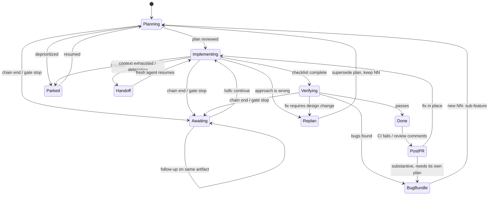

# SDLC skill

Orchestrates `prd` → `planning` → reviewer → implement → verify → reviewer, chained end to end,
with a pluggable reviewer model and resumable per-feature state.

- Read [`GRAMMAR.md`](./GRAMMAR.md) before parsing any invocation — dispatch precedence, phase chains, gate semantics, pause lifecycle
- Read [`PHASES.md`](./PHASES.md) before executing any phase — per-phase agent behavior, resume rules, execution modes, handoff protocol
- Read [`EXAMPLES.md`](./EXAMPLES.md) for 9 worked usage examples with verbatim prompts
- Additive: `prd` and `planning` still work standalone without this skill

## Skills this one chains

This skill orchestrates; it does **not** restate the rules of the skills it calls.
Load each one at the phase that needs it — do not write the artifact from memory.

| Phase | Read this skill first | For |
|-------|----------------------|-----|
| PRD | **`prd`** (+ its `FORMAT.md`) | PRD structure, crisp one-line requirements, no file paths |
| Plan / sub-plan | **`planning`** (+ its `FORMAT.md`, `SECTIONS.md`) | Plan sections, boundary contracts, diagrams, checklist format |
| Implement | **`coding-agent-guardrails`**, then **`coding`** | Repo hygiene, then code quality |
| Implement (Android) | **`android-coding`** as well | Kotlin/Compose rules on top |
| Review | the same skill that governs the artifact under review | Reviewer checks against the real rules, not its own taste |

**Explicit load instructions — one per dependency:**

- Read the `prd` skill before writing any PRD
- Read the `planning` skill before writing any plan or sub-plan
- Read the `coding-agent-guardrails` skill before touching any file
- Read the `coding` skill before writing or editing source
- Read the `android-coding` skill as well when the work is Android/Kotlin/Compose

- Resolve by **skill name**, not by path — install layout differs per CLI
- A skill that isn't installed → say so and continue; never silently improvise its rules

---

## Config schema

- Discovery order: project `.vibekit.yaml` (repo root) → hardcoded defaults below
- No global tier in V1

```yaml
# .vibekit.yaml — common case. FULL SCHEMA: `.vibekit.example.yaml` (canonical)
sdlc:
  agents:
    reviewer:
      model: opus      # any model, or ${CLI_DEFAULT}
      gate: llm        # llm | user | both
      max_iterations: 2
screenshots:
  policy: transient    # transient | permanent
```

> **Canonical schema: [`.vibekit.example.yaml`](../../.vibekit.example.yaml)** — every field,
> its default, and whether it is honored or reserved. This block is a subset; it never
> defines a field the canonical file doesn't.

- **No `.vibekit.yaml` present** → every value above is the default; screenshots stay `transient`
- `sdlc.agents.reviewer.model: ${CLI_DEFAULT}` sentinel resolves per CLI:

| Sentinel | Claude Code | Cursor | Gemini CLI |
|----------|-------------|--------|------------|
| `${CLI_DEFAULT}` | `opus` | `claude-sonnet` | `gemini-3.5-pro` |

- Reviewer model unavailable under `gate: llm`/`both` → warn and continue without review; the LLM review is an enhancement, not a gate
- Under `gate: user` no reviewer is requested, so the unavailable-fallback does not apply — the human stop still holds

**`sdlc.agents.reviewer.gate` — who closes an artifact phase:**

| `gate` | Reviewer subagent | Stops for human | `max_iterations` applies |
|--------|:-----------------:|:---------------:|:------------------------:|
| `llm` (default) | ✅ | ❌ auto-advance when clean | ✅ |
| `user` | ❌ | ✅ | ❌ n/a |
| `both` | ✅ | ✅ | ✅ |

- Gate is standing policy; a phase chain is per-invocation scope — full rules in [`GRAMMAR.md`](./GRAMMAR.md)
- The **chain end always stops for the human**, whatever the gate

---

## Feature → sub-feature decomposition

| Term | Meaning |
|------|---------|
| **Feature** | top-level unit; owns the master PRD + master `arch`-or-`plan`, written once |
| **Sub-feature** | the actual unit of work; owns its own optional PRD, plan, impl, verification |

- Master-level artifact is `arch-<feature>.md` (rare — system-level decomposition, spawns **parts**) or `plan-<feature>.md` (the default — may spawn **sub-plans**)
- The `root` subfeature entry is created **at feature creation (M1)**, not at decomposition — this gives `awaiting_*` a home during the master PRD/plan phases too, before any decomposition has happened. An `arch` decomposition into ≥1 parts retires `root` in favor of the numbered parts; zero parts (or no `arch` at all) leaves `root` as the sole queue entry executing `plan-<feature>.md`

| Origin | Trigger |
|--------|---------|
| Planned | Master `arch` spawns a part upfront (`01-data-layer`, `02-api`, `03-ui`), or the zero-parts `root` entry |
| Bug bundle | Cluster of bugs found during verification (`04-fix-nav-regressions`) |
| Requirement change | New/clarified requirement mid-flight |
| Specificity refinement | Original requirement too vague to implement |

- One sub-feature = one plan = one review-implement-verify cycle = one commit
- Sub-feature may have its own PRD when its user-facing behavior isn't covered by the master PRD
- Bug bundles are **clustered** — never one-plan-per-bug
- Feature size (PRD needed or not) is **asked**, never inferred

---

## Workflow

```
/sdlc <feature>
      │
      ▼
read .vibekit.yaml (defaults if absent)
      │
      ▼
FEATURE LEVEL (once)
  create state file with one `root` entry (origin: planned) — awaiting_* has a home from here on
  prd-<feature>.md          → review     (if large feature)
  arch-<feature>.md (rare)  → review     (only if system-level decomposition is needed)
  plan-<feature>.md         → review     (root's plan phase — same artifact, do not re-review at implement)
  decompose: arch → NN- parts, retire `root`   |   no arch / zero parts → keep `root` as the sole entry
      │
      ▼
   queue empty? ──yes──▶ move to done/, prompt: create PR?
      │ no
      ▼
SUB-FEATURE CYCLE
  prd? → review
  plan → review
  implement (mark [x])
  verify (tests + device)
  final review
  cleanup + commit
      │
      └─ bugs found → cluster into new NN- sub-feature → back to queue
```

- **Outer loop** — iterates over the sub-feature queue until empty; a feature that decomposed into zero parts still has exactly one queue entry (`root`) — the queue is never empty on first entry
- **Inner cycle** — PRD (optional) → plan → review → implement → verify → review, per sub-feature
- **`root` skips its own plan phase** — its artifact IS `plan-<feature>.md`, already reviewed at FEATURE LEVEL; `root` enters the inner cycle at `implement` (`master.plan: complete` is the signal) — never review that file twice
- Every review step under `gate: llm`/`both` reads `sdlc.agents.reviewer.model` and caps at `max_iterations` (default 2), then escalates to the user
- **A phase chain truncates this flow** — `/sdlc plan <feature>` stops after the plan and waits for you (see [`GRAMMAR.md`](./GRAMMAR.md))

---

## Execution modes



| # | Mode | Trigger | Required agent behavior |
|---|------|---------|------------------------|
| **M1** | Fresh start | `/sdlc <feature>` on new feature | Create dir + state file **with one `root` subfeature entry** (`origin: planned`) so `awaiting_*` always has a home, even before decomposition; ask feature size; never skip PRD silently |
| **M2** | Resume | `/sdlc <feature>`, state file exists | Read state → jump to first non-complete phase; never redo completed checklist items |
| **M3** | Handoff / delegate | Context low, or user delegates | Verify self-containment bar; commit checklist state; report `[x]`/`[ ]` + next item |
| **M4** | Replan | Impl approach wrong, or main drifted | Supersede plan in place, keep same `NN`; record `superseded_reason`; re-review |
| **M5** | Bug bundle | Verification found bugs | Cluster ALL open bugs into ONE new `NN-` sub-feature — never one-plan-per-bug |
| **M6** | Mid-flight scope change | New requirement during impl | Small + in-scope → amend plan; else new sub-feature. Never silently widen scope |
| **M7** | Park / defer | Blocked or deprioritized | Move feature dir to `pending/`; state records `parked_reason` + last completed |
| **M8** | Post-PR feedback | CI red, or review comments | Same decision as M5/M6 — trivial → fix in place; substantive → bug bundle |
| **M9** | Scoped invocation | `/sdlc <chain> <feature>`, or a gate stop | Run exactly the chain; stop at its end; set `awaiting_phase` + `awaiting_artifact`; report what would come next but do NOT start it |

- Full per-mode rules (M2-M9 decision tables, canonical prompts): `PHASES.md`
- Chain parsing, gate semantics, and the pause lifecycle: `GRAMMAR.md`

---

## Subcommands

| Command | Action | Output |
|---------|--------|--------|
| `/sdlc <feature>` | Start or resume, full chain | Restates phase + next unchecked item |
| `/sdlc <chain> <feature>` | Run only those phases, then stop | Artifact path + `AWAITING: <phase>` + what would come next |
| `/sdlc continue` | Advance exactly ONE phase past the pause | New phase run, then awaits again |
| `/sdlc status` | Current state | Feature, sub-feature, mode, `AWAITING: <phase> — <artifact>`, `[x]`/`[ ]` counts, next item |
| `/sdlc list` | All features | Table: feature, state dir, sub-feature count, parked_reason, `AWAITING:` |
| `/sdlc add <name>` | Append sub-feature | New `NN-` dir + queue entry |
| `/sdlc bugs` | Cluster bugs | Proposed grouping, waits for approval |
| `/sdlc prd <feature>` | PRD-only mode | Iterates PRD; does NOT advance to plan |
| `/sdlc handoff <sub>` | Prep delegation | Self-containment report + paste-ready prompt |
| `/sdlc replan <sub>` | Supersede plan | Validity check first, then supersede if needed |
| `/sdlc park <feature>` | Park to pending/ | Moves dir, records `parked_reason` |

---

## Invocation grammar

> Read [`GRAMMAR.md`](./GRAMMAR.md) before parsing any invocation — this table is the summary, that file is the rule.

```
/sdlc [<chain>] <feature>
```

| Phase token | Alias | Runs |
|-------------|-------|------|
| `prd` | — | Write / iterate the PRD |
| `plan` | — | Write / iterate the plan |
| `implement` | `impl` | Work the checklist |
| `verify` | — | Tests + device verification |
| `review` | — | One reviewer pass on the newest completed artifact |

- Separators `+` and `-` are interchangeable — `/sdlc prd+plan auth` ≡ `/sdlc prd-plan auth`
- **Dispatch precedence:** registered subcommand → `prd` → chain → feature name; arg 1 is a chain **iff** every `+`/`-` segment is a phase token
- `/sdlc backup-restore` is a **feature**, not a chain — `backup` is not a phase token
- **Chain end is a hard stop** — never run a phase outside the chain, even after a clean review
- Tokens run in canonical order regardless of typed order; the reorder is announced **before** the first write
- Ambiguity (a feature dir named like a token) → stop and ask, zero writes first

---

## `.sdlc-state.yaml` schema

> Progress lives in the plan checklist, NOT in per-phase state fields. Checklist wins on conflict (see `PHASES.md`).

```yaml
feature: auth-flow
worktree: /home/gb/code/proj/worktrees/wt-1   # guards wrong-worktree writes
created: 2026-07-25T10:00:00Z

master:
  prd: complete            # complete | skipped | pending
  plan: complete           # covers arch-or-plan completion — no separate `arch:` field, no master-level exec state

current_subfeature: 03-fix-nav-regressions

subfeatures:
  # Zero-parts decomposition: master `plan-<feature>.md` executes as one degenerate queue entry —
  # every existing mechanism (awaiting_*, drain gate, M3 handoff, M4 replan) works unchanged.
  - id: root
    origin: planned
    mode: implementing
    last_completed: "1.2"
  - id: 01-data-layer
    origin: planned         # planned|bug-bundle|requirement-change|refinement
    mode: done               # planning|implementing|verifying|parked|handoff|cancelled|done
    commit: a1b2c3d
  - id: 03-fix-nav-regressions
    origin: bug-bundle
    spawned_from: 02-api
    mode: implementing       # NEVER overwritten by a pause — see awaiting_phase
    phase_chain: [plan]      # scope of the last invocation; null = default full chain
    awaiting_phase: plan     # null | prd|plan|implement|verify|review — non-null ⇒ DO NOT ADVANCE
    awaiting_artifact: ".feature-plans/wip/auth-flow/03-fix-nav-regressions/plan-03-fix-nav-regressions.md"
    superseded_reason: null  # set on M4 replan
    parked_reason: null      # set on M7
    last_completed: "2.3"    # checklist id — resume anchor
    handoff:
      next_item: "2.4"
      returned_at: null      # set when the delegate reports done
      verified_by: null      # parent that re-ran the verify items
```

- `awaiting_phase` and `awaiting_artifact` are **null together or non-null together**; for `implement`, the artifact is the plan file
- The pause is an **orthogonal field, never a `mode` value** — folding it into the `mode` enum would destroy the prior mode with nothing to restore on `/sdlc continue`
- `phase_chain` lives per sub-feature, not feature-wide — the sub-feature is the unit of work
- **No schema change for zero-parts features:** `master.plan` covers arch-or-plan completion either way; master-level execution state has nowhere else to live (`mode`, `awaiting_phase`, `last_completed`, `handoff` are all `subfeatures[]` fields) — so it lives on the `root` entry like any other sub-feature

---

## Runner — where subagents execute

> Agent routing is configured in [`.vibekit.example.yaml`](../../.vibekit.example.yaml)
> under `sdlc.agents.<name>.run_in`. Only `implementer` is honored today; the rest are reserved.

| Role | Interactive | Needs isolation | Default | Why |
|------|:----------:|:---------------:|---------|-----|
| Planner | **Yes** | No | in-harness | Detaching breaks the PRD/plan iteration loop |
| Reviewer | No | No | in-harness | Read-only, short-lived |
| Implementer | No | **Yes** | in-harness → meta-harness when configured | Long-running; survives session death |
| Verifier | No | No | in-harness | Needs the parent's device/emulator context |

**Placeholders in `spawn.command`:** `{worktree}` `{model}` `{prompt}` `{prompt_file}` `{feature}` `{subfeature}`

**Fallback chain:**

```
mode: auto  (default)
  → everything in-harness
  → if a harness is detected, print ONCE:
      "vibe-station detected — set spawn.meta_harness to delegate implementers"
  → never delegates on detection alone
mode: meta-harness
  → use it for agents whose `run_in` is `meta-harness`
  → not detected → WARN + fall back to in-harness, continue (never hard-fail)
mode: in-harness
  → always in-harness, even if a harness exists; ignores every agent's `run_in`
```

- **Default is in-harness for every role** — no config always means in-harness
- Only the **implementer** benefits from delegation — the other three are actively worse detached
- The runner block is **generated from the initial prompt + detection**, then shown for approval — never silently written
- V1 spawns sequentially; parallel sub-features are a future phase
