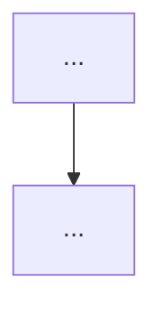

<!--
RULES — read before writing this report:
1. This is a SMALL file — bugs, root cause, action items, optional diagrams. Nothing else.
2. FORMAT: tables, bullet points, mermaid diagrams ONLY — no prose paragraphs
3. An empty section is omitted entirely, never left as a stub heading
4. This file MUST be written to disk at the path below — never answer `/sdlc report` in chat only
-->

# SDLC report: <feature>[/<sub-feature>]

**Date:** YYYY-MM-DD · **Commit:** <sha> · **Sub-feature(s) covered:** <NN-name, ...>

## Bugs
| # | Symptom | Where found | Severity |
|---|---------|-------------|----------|
| … | … | `verify` / device / CI | … |

## Root cause
- One bullet per cluster, not per bug — clustering already happened in `/sdlc bugs`
- `<cluster name>` → `file:line` or component → root cause in one line

## Action items
| # | Action | Owner sub-feature | Status |
|---|--------|--------------------|--------|
| … | … | `NN-<name>` or "new bundle" | open / in progress / done |

## Diagrams
<!-- optional — omit this section entirely if nothing needs a diagram -->

